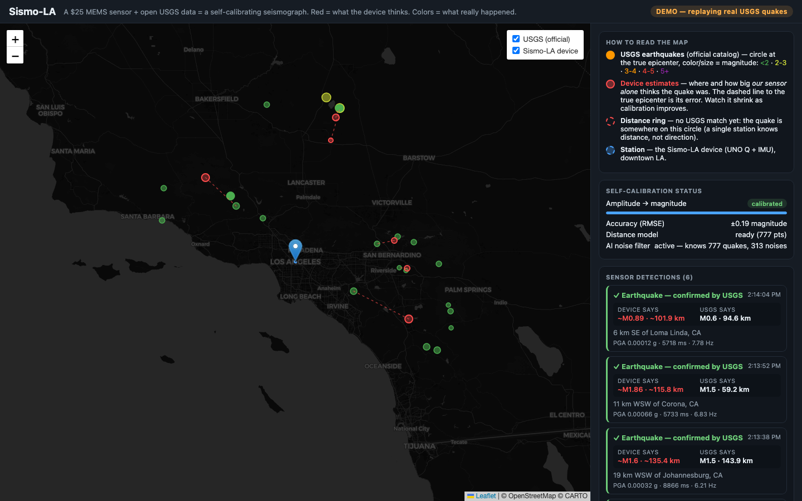
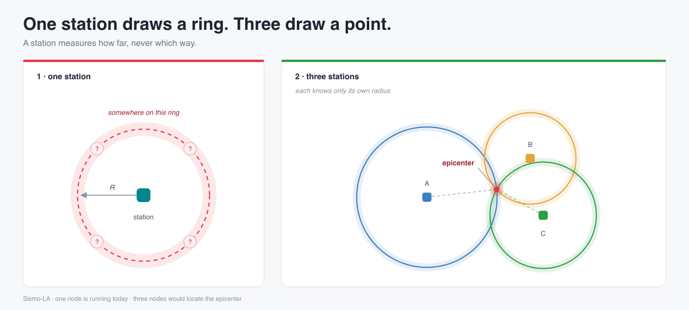

# Sismo-LA — un sismographe domestique qui apprend sur la liste officielle des séismes

[English](README.md) · [Français](README.fr.md)

Sismo-LA est une petite station dans le comté de Los Angeles. Elle est dans une
maison, tourne sur une alimentation USB-C et le WiFi, et coûte environ 80 $. Un
accéléromètre MEMS (une puce qui mesure l’accélération, la même famille que
dans un téléphone) enregistre quand le sol ou le bâtiment tremble. Le
[catalogue USGS](https://earthquake.usgs.gov/) est la liste officielle des
séismes : en quelques minutes il publie la **magnitude** (la taille, notée M3,2
par exemple), le lieu, la profondeur et l’heure exacte.

Le travail de la station : apparier *ce que cette boîte a mesuré* et *ce que
l’USGS dit qu’il s’est passé*, puis ajuster un modèle **lié au site** : comment
*ce* capteur, sur *cette* étagère, dans *ce* bâtiment, convertit une secousse
en magnitude et en distance. Après cet ajustement, le modèle peut tourner le
réseau débranché.

Question testée :

> Un nœud à ce prix peut-il détecter un séisme et estimer sa magnitude, sans
> surveillance, sans que personne ne le calibre à la main ?

Page publique (les coordonnées de la station ne sont pas publiées) :
<https://medialoco.github.io/sismo-la/>



*Tableau de bord opérateur. Les cercles colorés sont les événements USGS ; le
rouge, les estimations de l’appareil ; les trois modèles à droite. Cette
capture est en `--replay` (voir [Replay](#replay-un-test-du-logiciel)) :
amplitudes synthétiques, 38× trop grandes. Elles testent le code, pas le
capteur.*

## Vocabulaire

| Terme | Sens ici |
|---|---|
| **Station / nœud** | Cette boîte : Arduino UNO Q + module MEMS + alimentation + WiFi. |
| **MCU** | Le microcontrôleur temps réel (STM32). Il lit le capteur 100 fois par seconde et décide du début d’une secousse. |
| **Côté Linux** | Le processeur d’application de la carte. Il parle à l’USGS, stocke, ajuste les modèles, sert le tableau de bord. |
| **PGA** | Peak ground acceleration : la plus grande accélération d’une secousse, en *g* (1 g ≈ 9,8 m/s²). Un pas dans cette maison, c’est quelques millièmes de g. |
| **STA/LTA** | Short-term average / long-term average. Déclencheur sismique classique : énergie des 0,5 dernières secondes divisée par celle des 10 dernières. Quand le rapport saute, le MCU déclare un événement. Il n’y a pas de ligne fixe « tirer à 0,01 g » ; le plancher suit le bruit récent. |
| **Déclencheur aveugle** | Le STA/LTA qui tire tout seul, sans l’aide du catalogue. |
| **Enveloppe** | Une trace à 1 Hz de la force du mouvement filtré (0,7–12 Hz). Un fichier CSV par jour UTC. Permet de *revenir* sur une seconde où le déclencheur n’a pas tiré. |
| **z** | Nombre de dispersions de bruit local au-dessus des minutes précédentes. z = 4,0 est le seuil de confirmation. |
| **Calibration** | Ajuster `magnitude ≈ a·log10(PGA) + b·log10(distance) + c` sur des exemples appariés. Huit correspondances avant que le modèle d’amplitude soit traité comme utilisable. Les coefficients appartiennent à cette installation. |
| **Mouvement fort** | Sensible aux secousses proches, d’échelle « ressentie ». Ce nœud n’enregistre pas les séismes lointains (téléséismes). |

## Deux canaux à tenir séparés

Une puce MEMS ne distingue pas un séisme d’une porte claquée. L’USGS si. La
station a donc deux façons de regarder le sol, comptées à part.

| Canal | Ce qui s’est passé | Peut entraîner le modèle d’amplitude ? |
|---|---|---|
| **Détection** | Le STA/LTA aveugle a tiré tout seul. Si l’USGS a ensuite un séisme à cette seconde, le couple (PGA, M et distance catalogue) est un exemple de calibration. | oui |
| **Confirmation** | L’USGS a publié une heure d’origine. La station a calculé quand les ondes devaient arriver et a lu l’enveloppe stockée. Si l’enveloppe est élevée (z ≥ 4), le sol a bougé. La station n’a pas trouvé cette seconde toute seule. | non |

Les confirmations sont exclues parce qu’elles sont *sélectionnées* pour être une
grande excursion près du bruit : leur PGA est biaisé vers le haut. Ajuster une
loi de magnitude sur cet ensemble cuirait le biais
(`retro.feed_calibration: false`).

Le journal, le tableau de bord et la page publique tiennent deux listes.

## Déroulement d’un cycle

1. **Sentir.** Le MCU fait tourner le STA/LTA. Sur un déclenchement il envoie
   trois nombres via le Bridge de la carte : PGA, durée, fréquence dominante.
2. **Demander.** Linux interroge le FDSN USGS dans un rayon de 160 km. La carte
   montre les événements jusqu’à M0,5 ; un appariement de calibration doit être
   ≥ M2.
3. **Étiqueter.** Même seconde qu’un séisme catalogue → un couple
   d’apprentissage. Pas d’événement catalogue → un exemple de bruit (camion,
   pas).
4. **Ajuster.** Trois modèles se mettent à jour à chaque exemple. Une fois
   assez de points, ils sont stockés sur disque et tournent hors ligne.

| Modèle | Entrée → sortie | Utilisable après |
|---|---|---|
| Calibration d’amplitude | log10(PGA), log10(distance) → magnitude | 8 correspondances séisme |
| Modèle de distance | durée, fréquence dominante → distance épicentrale | 5 correspondances |
| Filtre de bruit | PGA, durée, fréquence → P(c’est un séisme) | 3 séismes + 3 bruits |

Détails : [`docs/calibration.md`](docs/calibration.md).

**Recherche rétrospective.** Indépendamment du déclencheur, la station
enregistre l’enveloppe en continu. Quand l’USGS publie une origine, elle
relit les quelques secondes où l’onde S devait arriver (quelques dizaines de
secondes plus tard, selon la distance). C’est une poignée de fenêtres par
séisme, contre environ 170 000 fenêtres STA/LTA aveugles par jour : le test
peut se placer plus près du bruit et moyenner le train d’ondes. Sur le bruit
de cette station, le gain de portée est un **facteur 7–8 en amplitude, une
unité de magnitude**.

## État (2 septembre 2026)

La station est autonome : alimentation propre, WiFi, pas d’ordinateur branché,
pas de shell requis. Elle publie un instantané JSON toutes les 20 minutes. Si
rien n’a changé, elle envoie quand même un heartbeat après 4 heures, pour que
la page publique distingue une nuit calme d’un publisher mort. Après un vrai
débranchement, le tableau de bord a répondu en **4 min 24 s**. Une panne de
5 h 43 min a montré le MCU redémarrant depuis sa propre flash.

**Calibration d’amplitude : 0 sur 8.** **Détections autonomes de séismes : 0.**
Un séisme catalogué a été **confirmé** dans l’enveloppe (section suivante).

## Confirmation : `ci41540608`

Événement USGS M3,2, Ontario, Californie, 2 septembre 2026, 12:37:12 UTC.

| Grandeur | Valeur | Lecture |
|---|---|---|
| z d’enveloppe | 4,34 (seuil 4,0) | la trace était 4,34 dispersions au-dessus des minutes précédentes |
| Crête / baseline | 0,001095 g / 0,0003816 g | environ 3× le niveau calme, encore une petite accélération |
| Fenêtre / décalage | 20 s, 24 s après l’origine | 24 s est un temps de trajet S ordinaire à cette distance |
| STA/LTA aveugle | ~0,0033 g requis ; n’a pas tiré | le déclencheur voulait ~3× l’amplitude arrivée |
| Site | au repos | bruit électrique du capteur ; personne au-dessus de la boîte |
| Compteur de calibration | toujours 0 sur 8 | une confirmation n’a pas le droit de l’incrémenter |

Un événement, pas un taux. z = 4,34 est une marge mince au-dessus de 4,0. Un
taux de fausse confirmation de 1 sur 1 200 a été calculé sur du *bruit de
capteur pur* ; cette maison produit aussi ses propres impulsions, donc ce
1-sur-1 200 est optimiste jusqu’à recalcul sur l’enveloppe enregistrée. Le
test z ne regarde pas le décalage : les 24 s sont une preuve indépendante.

## Quelle taille de séisme elle peut attraper

Le plancher du déclencheur est une propriété du site (bruit + couplage),
mesuré sur 163 vrais déclenchements : le plus petit PGA qui ait tiré est
**0,0034 g** (0,0044 g dans la fenêtre la plus calme). Passé dans la loi de
mouvement du sol ci-dessous, ce plancher devient une **magnitude requise** à
une distance donnée (±0,45 à 1σ). Sous M3, les chiffres sont des
extrapolations :

| Magnitude requise | 10 km | 30 km | 50 km | 100 km | 160 km |
|---|---|---|---|---|---|
| Déclencheur aveugle | 3,1 | 3,9 | 4,3 | 4,9 | 5,3 |
| Recherche rétrospective | 2,1 | 2,9 | 3,3 | 3,9 | 4,3 |

Ces seuils, croisés avec 2 185 vrais événements USGS (M ≥ 2, 160 km, 5 ans)
et la dispersion 0,39 log10 de la loi, amplification de site inconnue ×1 à ×4 :

| | séismes / an | attente moyenne | P(au moins un avant le 13 sep 2026) |
|---|---|---|---|
| Déclencheur aveugle seul | 2,0 – 9,8 | 37–184 jours | 6–28 % |
| Déclencheur + recherche rétrospective | 9,9 – 36,9 | 10–37 jours | 28–70 % |

La ligne rétrospective suppose la maison au repos (environ la moitié des
heures ici). À une heure passante, l’enveloppe erre d’environ ×4 ; à une heure
calme, ~3 %. Les fichiers d’enveloppe existent depuis le 1er septembre 2026 ;
les heures antérieures ne sont pas cherchables.

## Loi de mouvement du sol

Une **loi de mouvement du sol** prédit le PGA à partir de la magnitude et de
la distance. La station utilise la même forme algébrique à l’envers : PGA et
distance connus, estimer M. Les coefficients ont été ajustés sur **12 324
valeurs de PGA** réellement enregistrées par des stations ShakeMap USGS pendant
40 séismes du sud de la Californie (M3,03–5,51, 3–200 km, 1 006 stations) :

`PGA_pred = 0,867·M − 1,740·log10 R − 3,305`  (log10 g)

dispersion 0,390 log10, R² = 0,80. Un jeu de coefficients antérieur
surestimait l’amplitude de 37,9× (environ deux unités de magnitude).

## Un silence, c’est « en panne » ou « il ne s’est rien passé » ?

Une liste de détections vide est ambiguë. Pour chaque séisme catalogué, la
station (1) prédit le PGA que la loi dit qui aurait dû arriver, et (2) lit le
bruit dans lequel elle était vraiment assise à cette seconde. Cinq classes :

| Classe | Sens |
|---|---|
| Hors de portée | PGA attendu sous ce que ce site peut voir ; normal pour ~99 % du catalogue |
| Marginal | près du plancher ; à ne pas traiter comme un oubli |
| Déclenché | le STA/LTA aveugle a tiré et a été apparié |
| Confirmé | enveloppe élevée à l’arrivée prédite |
| Aurait dû être vu | à portée, site assez calme, rien dans l’enregistrement → une panne |

30 jours au 2 septembre 2026 : **19 événements catalogués, 1 confirmé, 0
aurait-dû-être-vu.** La page publique publie les mêmes trois comptes sur une
fenêtre glissante de 336 heures (14 jours), plus courte, donc le premier
chiffre bouge. La liste des événements à portée encoderait une distance et
reste sur le réseau local. Méthode :
[`docs/expected-vs-observed.md`](docs/expected-vs-observed.md).

## Autres mesures

| Observation | Valeur |
|---|---|
| Taux de déclenchement après passage d’un bureau à un support plus raide | 22,6 → 3,2 événements / h (−86 %). Plancher 0,00087 → 0,00066 g (−24 %). Le couplage domine les faux déclenchements. |
| Mise sous tension → tableau de bord qui répond | 4 min 24 s. Un sidecar watchdog relance le conteneur ; App Lab l’arrête sinon une seconde après le boot. |
| Fréquence dominante (après un bug de signe : échantillon centré vs non centré) | vrais taps à 2,6 / 5,0 / 10,6 Hz. Le bug imprimait ~25 Hz sur tout signal. |

Le seul signal indépendant « le capteur est vivant » est le battement MCU
(~10 s). Un 200 du tableau de bord web veut dire que le processus Linux tourne.
`health.stale` pilote le badge public et une bannière `STATION DEGRADED`.

## Replay : un test du logiciel

`python main.py --replay` tire le vrai catalogue des 24 dernières heures et
*invente* le PGA à partir de la magnitude et de la distance via l’*ancienne*
loi (avant réajustement), donc les fausses amplitudes sont 38× trop grandes.
C’est volontaire : des valeurs corrigées resteraient sous le déclencheur et la
démo ne montrerait rien. Le calibreur ajuste alors l’inverse de cette même loi.
Les résidus du replay testent le pipeline. Ils sont circulaires. Ils ne sont
pas physiques.

Le RMSE du tableau de bord est un résidu **intra-échantillon** (le modèle noté
sur des points qu’il a déjà ajustés) et on lui donne la *vraie* distance
catalogue. En direct, il n’a qu’une distance *estimée*. `python audit.py`
parcourt le journal dans l’ordre du temps et note chaque point avec le modèle
*tel qu’il était avant ce point* (hors échantillon, préquentiel) :

| Estimateur | run A (11 pts) | run B (27 pts) |
|---|---|---|
| Intra-échantillon, vraie distance (ce que le panneau montre) | 0,20 Mw | 0,18 Mw |
| Hors échantillon, vraie distance | 0,30 Mw | 0,21 Mw |
| Hors échantillon, distance estimée (chemin en direct) | 1,10 Mw | 0,26 Mw |

À 11 points, le 1,10 Mw est dominé par les premières prédictions, quand le
modèle n’avait presque aucune donnée. Le tableau documente la méthode de
notation.

## Limites

- La station rapporte des séismes déjà produits. Elle ne prévoit pas.
- Déplacer la boîte rend les coefficients faux jusqu’à un nouvel ajustement.
- Un seul PGA est un substitut bruité de l’énergie libérée. ±0,3–0,5 en
  magnitude est le plafond réaliste même avec un bon ajustement.
- Mouvement fort seulement. Pas de téléséismes.
- La méthode a besoin d’une région active et d’un catalogue publié en quelques
  minutes. Le sud de la Californie s’en rapproche.

## Coût (prix au 1er septembre 2026)

| Pièce | Prix | Source |
|---|---|---|
| Arduino UNO Q 2 GB (ABX00162) | 59,00 $, ou 44,00–45,20 $ | store.arduino.cc ; DigiKey, PiShop, Farnell |
| Modulino Movement (ABX00101, LSM6DSOX) | 11,80 $ | store.arduino.cc |
| Alimentation USB-C, 5 V / 3 A | ~15 $ | courant, estimation |
| **Un nœud** | **71–86 $** | ~90 $ avec taxes et port |

Un chiffre de 25 $ utilisé plus tôt dans ce projet était faux : l’UNO Q seul
coûte plus. Raspberry Shake le même jour : 294,99 $ la carte, 584,99 $ clé en
main ([raspberryshake.org](https://raspberryshake.org/pricing)). Liste :
[`docs/hardware.md`](docs/hardware.md).

## Ce que trois stations ajouteraient (géométrie, pas un résultat)



Le micrologiciel stocke la *norme* du vecteur d’accélération : la direction
est jetée. L’onde P (l’arrivée dont la polarisation pointe vers la source) est
sous ce déclencheur. Une station donne donc une **distance**, un anneau sur la
carte. Trois anneaux s’intersecteraient. Chaque nœud ajusterait encore ses
coefficients sur le catalogue. Ceci n’a pas été construit : une station, une
confirmation, zéro détection autonome.

## Lancer sans matériel

Le replay utilise le vrai catalogue et des amplitudes synthétiques (voir plus
haut).

```bash
cd python
python3 -m venv .venv && source .venv/bin/activate
pip install -r requirements.txt
cp config.example.yaml config.yaml

python main.py --replay       # puis http://localhost:8000
python audit.py               # résidus hors échantillon du journal
python audit.py --include-synthetic
```

`python main.py --mock` invente des secousses. `python main.py` parle à un vrai
capteur. Sur la carte, ce dossier *est* une App
[App Lab](https://docs.arduino.cc/) :

```bash
arduino-app-cli app start ~/ArduinoApps/sismo-la
arduino-app-cli app logs  ~/ArduinoApps/sismo-la
```

## Architecture

```
                     Arduino UNO Q
 ┌───────────────────────────┬────────────────────────────────┐
 │   STM32U585 (MCU)         │   Dragonwing QRB2210 (MPU)     │
 │   Zephyr RTOS, temps réel │   Debian Linux                 │
 ├───────────────────────────┼────────────────────────────────┤
 │ - IMU 100 Hz, LSM6DSOX    │ - WiFi + FDSN USGS             │
 │   Qwiic sur Wire1         │   (carte ≥ M0,5, appariements  │
 │ - STA/LTA 0,5 s / 10 s    │    ≥ M2, 160 km)               │
 │ - PGA, durée, f0          │ - corrélation, modèles,        │
 │ - événement ──────────────┼─►  enveloppe, retro, audit     │
 │   via le Bridge           │ - tableau de bord + publish    │
 └───────────────────────────┴────────────────────────────────┘
                    USGS: https://earthquake.usgs.gov/fdsnws/event/1/
```

Sur cette carte le connecteur Qwiic est **`Wire1`** (pas `Wire`). Le `Serial`
du MCU est les broches D0/D1, pas l’USB. Le Bridge MCU↔Linux exige des versions
alignées de `arduino-router` et de la bibliothèque bridge.
[`docs/getting-started.md`](docs/getting-started.md),
[`docs/hardware.md`](docs/hardware.md).

## Publication

`python/main.py` écrit un instantané JSON sur minuteur (`publish:` dans
`config.yaml`). [`web-remote/`](web-remote/) dessine la carte ;
[`data.html`](web-remote/data.html) sont les tableaux. L’instantané **n’a pas
de coordonnées**. `publish.include_location: true` place la station.

Le journal (`event_log.jsonl`) et les fichiers de modèles sont sur le disque
hôte, à côté du conteneur, et survivent aux redémarrages.

## Organisation

```
sismo-la/
├── app.yaml                   # manifeste App Lab
├── python/                    # moitié Linux (Dragonwing)
│   ├── main.py                # boucles, tableau de bord, publisher
│   ├── pipeline.py            # détection / corrélation
│   ├── usgs.py                # client catalogue USGS
│   ├── calibration.py         # modèles amplitude + distance
│   ├── classifier.py          # filtre séisme-vs-bruit
│   ├── envelope.py            # enveloppe continue (un CSV / jour UTC)
│   ├── retro.py               # retour à l’instant d’arrivée catalogue
│   ├── expected.py            # attendu vs observé
│   ├── audit.py               # score hors échantillon du journal
│   └── dashboard/index.html   # tableau de bord opérateur
├── sketch/                    # moitié MCU (STM32, Zephyr)
├── deploy/                    # watchdog qui relance le conteneur
├── docs/
└── web-remote/                # page publique sur GitHub Pages
```

## Liste

- [x] Nœud autonome : détecter → apparier à l’USGS → apprendre → publier.
- [x] Reprise après coupure (4 min 24 s).
- [x] Plancher de déclenchement et taux attendus mesurés.
- [x] Loi de mouvement du sol réajustée sur 12 324 PGA ShakeMap.
- [x] Enveloppe continue + recherche rétrospective (facteur 7–8 en amplitude),
      comptée à part des détections.
- [x] Première confirmation (`ci41540608`, M3,2, 2 septembre 2026). Le
      déclencheur aveugle demandait ~3× l’amplitude arrivée.
- [ ] Première détection autonome : aucune. Calibration d’amplitude 0 sur 8.
- [x] Audit catalogue ; 0 aurait-dû-être-vu sur les 30 jours au 2 septembre.
- [ ] Courbe de calibration sur vrais enregistrements, résidus tenus de côté.
- [ ] Vidéo du concours : replay + un tap en direct sur la boîte.

Candidature
[Invent the Future with Arduino UNO Q and App Lab](https://www.hackster.io/contests/invent-the-future-with-arduino-uno-q-and-app-lab),
**Best Social Impact**, clôture **13 septembre 2026**. Storyboard vidéo :
[`docs/hackster-story.md`](docs/hackster-story.md).

## Licence

MIT — [`LICENSE`](LICENSE).
