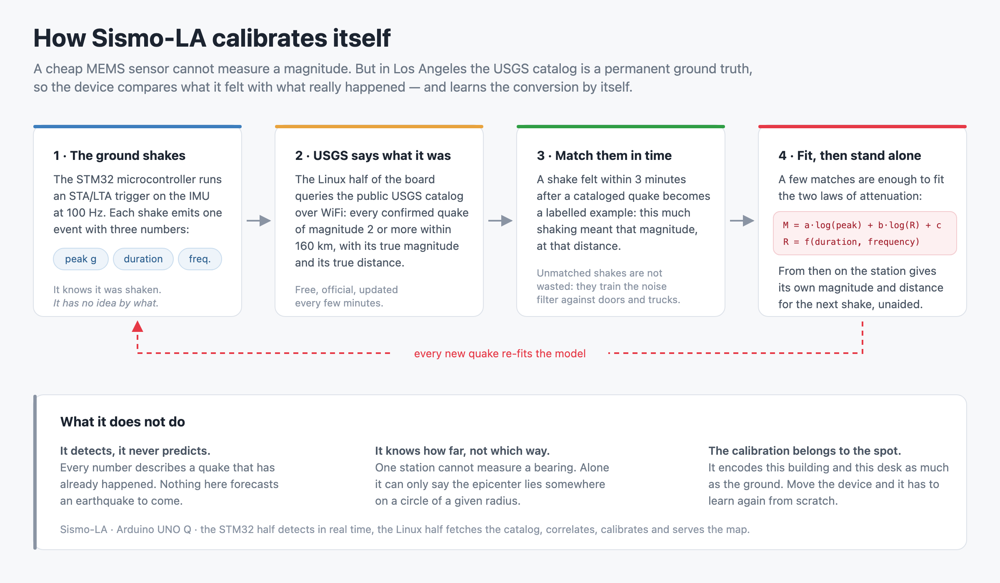
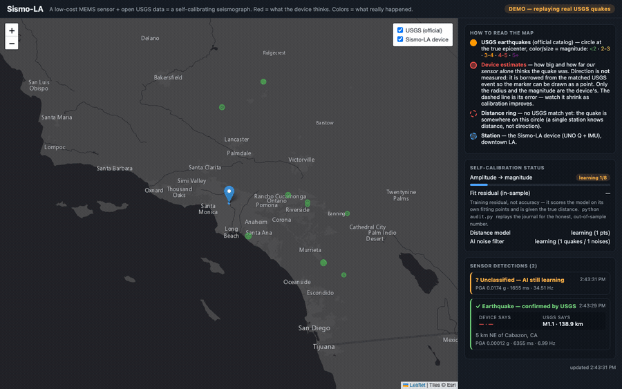

# Sismo-LA — a seismograph that learns from real Los Angeles earthquakes

A MEMS accelerometer costs a few dollars and can feel the ground move. It cannot
tell you *how big* the earthquake was, because nobody ever calibrated it — and
calibrating a seismic instrument normally takes a shake table or a professional
station sitting next to it.

In Los Angeles it takes neither. The USGS publishes magnitude, location and
depth for every earthquake it catalogs, within minutes — 2,136 of them inside
160 km of downtown over the last three months, about 23 a day. That feed is an
**answer key**. So the device grades itself:
it feels a shake, asks the catalog what really happened, and adjusts. After a
handful of confirmed matches it can put a number on a tremor on its own — and it
keeps that ability when you unplug the network.


*Left, the map: USGS earthquakes as colored circles (the truth), the device's own
estimates in red, joined by an error vector. Right, the panel: the three models
learning, live. Figures shown come from replay mode and measure the software —
see [What it is, and what it is not](#what-it-is-and-what-it-is-not).*

## The idea in 30 seconds



1. The sensor feels a shake and reduces it to three numbers: peak acceleration,
   duration, dominant frequency.
2. The board asks the USGS catalog whether a real earthquake just happened
   nearby.
3. **Match** → that pair (what I measured ↔ what it really was) is one training
   example. **No match** → it was a truck, which is a training example too.
4. Three models refit on every example. Nobody labels anything by hand.
5. Once converged, the models live on disk and run without the network.

The trick generalizes: *cheap sensor + free authoritative real-time feed =
calibrated autonomous instrument*. Earthquakes are simply the case where the
answer key is richest.

## See it work in 2 minutes

No hardware needed. Replay mode pulls the genuine catalog for the last 24 hours
and drives the full pipeline with it.

```bash
cd python
python3 -m venv .venv && source .venv/bin/activate
pip install -r requirements.txt
cp config.example.yaml config.yaml

python main.py --replay       # then open http://localhost:8000
```

Watch the side panel: the amplitude model flips to *calibrated*, the distance
model to *ready*, and the noise filter starts telling earthquakes from trucks.



*Sixteen seconds of replay, sampled every few seconds. The panel starts at
"learning 1/8" with an empty map and ends "calibrated" with the distance model
ready and the noise filter separating 24 quakes from 8 noises. Replayed catalog
data, not a live recording — the badge says so throughout.*
Other modes: `python main.py --mock` (synthetic shakes), `python pipeline.py
--mock` (headless), `python main.py` (real sensor on the board).

Then grade it honestly. Every detection is appended to `event_log.jsonl` along
with what the models predicted *before* they learned it, so the journal can be
replayed for out-of-sample residuals instead of the flattering training ones:

```bash
python audit.py                      # the honest scoreboard
python audit.py --include-synthetic  # also score --replay events (circular)
```

On the board itself this is one command, because the repository *is* an App Lab
App — `app.yaml` plus `python/` for the Linux half and `sketch/` for the MCU
half:

```bash
arduino-app-cli app start ~/ArduinoApps/sismo-la    # builds, flashes, runs both
arduino-app-cli app logs  ~/ArduinoApps/sismo-la    # both halves, interleaved
```

## How the learning loop works

Every confirmed match feeds three models, all persisted to disk:

| Model | Input → output | Usable after |
|---|---|---|
| Amplitude calibration | log10(PGA), log10(distance) → magnitude | 8 matches |
| Distance model | duration, dominant frequency → epicentral distance | 5 matches |
| AI noise filter | PGA, duration, frequency → P(real earthquake) | 3 of each class |

The amplitude model is a ground-motion prediction equation fitted backwards:
`M ≈ a·log10(PGA) + b·log10(R) + c`. Its coefficients are not universal
constants — they absorb this sensor, this mount, this building and this soil.
That is the point: no laboratory could have calibrated *this* installation.

The distance model exploits two classical regularities: coda duration grows with
distance, and dominant frequency drops with distance as high frequencies
attenuate first. With distance in hand, one station produces a full standalone
estimate.

The noise filter costs nothing extra: matched detections are earthquakes,
unmatched ones are noise, and a logistic regression refits online. It predicts
*before* learning from each new event, so the probability you see is never
computed on data the model has already seen.

Details in [`docs/calibration.md`](docs/calibration.md).

## What it is, and what it is not

**It detects, it does not predict.** The device characterizes earthquakes while
they happen. It says nothing about earthquakes that have not occurred yet, and
does not try to.

**Replay figures measure the software, not the sensor.** In `--replay` the
readings are *synthesized* from cataloged magnitude and distance through an
attenuation law, and the calibration then fits the inverse of that same law. It
proves the pipeline is correct and numerically stable; it is circular by
construction and measures no physical accuracy. Worse, the reported RMSE is an
in-sample training residual computed with the *true* catalog distance, while
live operation feeds it an *estimated* distance. Treat it as a software health
check, never as an accuracy claim. Real numbers need real recordings with
residuals on held-out events; that campaign is running.

**The dashboard number is the optimistic one, and now you can measure that.**
Every detection is journalled together with what each model predicted *before*
it learned that point, so `python audit.py` replays the journal and reports
genuine out-of-sample residuals instead of training ones.

What it reports so far, on two replay runs:

| Estimator | run A (11 pts) | run B (27 pts) |
|---|---|---|
| In-sample, true distance — *what the panel shows* | 0.20 Mw | 0.18 Mw |
| Out-of-sample, true distance | 0.30 Mw | 0.21 Mw |
| Out-of-sample, **estimated** distance — the operational path | 1.10 Mw | 0.26 Mw |

Two honest readings of that table. The out-of-sample figure is consistently
worse than the panel's, which is the expected direction. But it is wildly
unstable — 1.10 against 0.26 for the same pipeline — because prequential
scoring grades the earliest points with a model that has barely learned
anything, and with a handful of points those dominate. **At this sample size
none of these numbers is trustworthy in absolute terms, and that instability is
itself the finding.** They are quoted here to show the method, not to claim an
accuracy. Real figures need real recordings, and many more of them.

**The red markers do not measure direction.** A single station recovers distance
from the coda but not azimuth. When a catalog match exists the marker borrows
the true bearing so it can be drawn as a point; only its radius and magnitude
are the device's own. With no match it is drawn as a ring — the honest picture.
Three neighboring nodes would triangulate, which is the scaling story.

**It works disconnected, with one degradation.** The models are on disk and
inference touches no network, so the station keeps estimating magnitude and
distance while offline; reconnecting lets you check those estimates against the
catalog afterwards. But offline there is no match to borrow a bearing from, so
every output becomes a ring.

**We do not know how fast it converges, and we say so.** Counts from the USGS
API for June–August 2026 around downtown LA:

| | 160 km | 80 km | 50 km |
|---|---|---|---|
| M ≥ 0.5 | 2136 | — | — |
| M ≥ 2.0 | 110 | 26 | 13 |
| M ≥ 2.5 | 33 | 5 | 1 |
| M ≥ 3.0 | 12 | 2 | 0 |

The amplitude model needs 8 matches. If the sensor detects M2 at 160 km, that is
about a week. If it only feels M2.5 within 50 km, that is one event per quarter
and convergence takes years. The two answers differ by a hundredfold, and what
separates them is the sensor's true detection threshold — the quantity this
project has not yet measured. So no convergence time is claimed here.

**It is calibrated for one spot.** Move it, or even remount it, and it must
reconverge. Consequence of the method, not a defect.

**Expect ±0.3–0.5 magnitude at best.** PGA from a single cheap sensor is a noisy
proxy for released energy. A MEMS accelerometer is a strong-motion instrument:
it senses appreciable local shaking and records no teleseisms. Neighborhood
node, not observatory.

**It needs a busy region.** The method assumes frequent events and a promptly
published catalog. Southern California is near the ideal case; somewhere with
one felt earthquake a year, convergence would take decades.

## Hardware

- **Arduino UNO Q** (4 GB) — WiFi on board.
- **Arduino Modulino Movement** (ABX00101, LSM6DSOX) + its bundled Qwiic cable.
  The only part you add, and it plugs in — no breadboard, no soldering.
- USB-C data cable (development) or USB-C power supply (standalone).

Mounting matters more than the sensor: couple it rigidly to a concrete floor or
load-bearing wall, away from fans and foot traffic. Bill of materials and wiring
in [`docs/hardware.md`](docs/hardware.md).

## Dual-brain architecture

```
                     Arduino UNO Q
 ┌───────────────────────────┬────────────────────────────────┐
 │   STM32U585 (MCU)         │   Dragonwing QRB2210 (MPU)     │
 │   Zephyr RTOS, real time  │   Debian Linux                 │
 ├───────────────────────────┼────────────────────────────────┤
 │ - reads the IMU at 100 Hz │ - WiFi + USGS FDSN feed        │
 │   (LSM6DSOX via Qwiic,    │   (context ≥ M0.5, calibration │
 │    bus Wire1)             │    matches ≥ M2, 160 km)       │
 │ - STA/LTA trigger         │ - temporal correlation         │
 │ - PGA, duration, dominant │ - calibration + distance model │
 │   frequency per event     │ - AI noise filter (online      │
 │ - one JSON event ─────────┼─►  logistic regression)        │
 │   via Bridge Monitor      │ - Leaflet web dashboard        │
 └───────────────────────────┴────────────────────────────────┘
                    USGS: https://earthquake.usgs.gov/fdsnws/event/1/
```

The MCU runs STA/LTA, the trigger seismic networks have used for decades: a
0.5 s average of signal energy against a 10 s average, firing above a ratio of 4
and closing below 1.5, with the long-term average frozen during an event so the
earthquake cannot contaminate its own noise floor.

UNO Q gotchas we learned the hard way (details in
[`docs/getting-started.md`](docs/getting-started.md)):

- the Qwiic connector is on **`Wire1`**, not `Wire`;
- the MCU's `Serial` goes to the **D0/D1 pins, not USB** — events must go
  through the **Bridge Monitor** (the USB-C port belongs to the Linux side);
- the MCU↔Linux Bridge requires the board's `arduino-router` and the
  `Arduino_RouterBridge` library to be **version-matched** — update the board
  OS before flashing.

## Autonomous operation

The station needs only WiFi and USB-C power — no attached computer. Beyond its
local dashboard, `python/main.py` can push a JSON snapshot (detections, estimates,
calibration state) to a remote site on a timer (`publish:` block in
`config.yaml`: HTTP POST, file write, or any upload command such as `scp`).
The static page [`web-remote/index.html`](web-remote/index.html) reads that
snapshot, and this repository publishes it at
**<https://medialoco.github.io/sismo-la/>**. No backend, no build step, nothing
to pay for. If `station.json` is missing, the page shows the USGS catalogue
alone rather than breaking — which is what it is doing right now.

**The published snapshot carries no coordinates.** The public page outlines the
catalogued events the station recognised and plots the magnitude it read against
the magnitude the USGS published; none of that needs to know where the box sits.
This also removes a dishonesty: a single station measures a distance, never a
bearing, so the earlier red epicenter marker only landed somewhere because it
borrowed the direction from the event it was supposed to be estimating. Set
`publish.include_location: true` to put the station back on the public map.

## Repository layout

The three top-level items are exactly what Arduino App Lab expects of an App:
the manifest, the Linux half, the MCU half.

```
sismo-la/
├── app.yaml                   # App Lab manifest (name, ports, bricks)
├── python/                    # runs on the Dragonwing MPU (Debian)
│   ├── main.py                # App Lab entry point: loop + dashboard + publisher
│   ├── pipeline.py            # detection/correlation helpers + headless CLI
│   ├── usgs.py                # USGS FDSN client (LA-centered)
│   ├── calibration.py         # amplitude model + distance model (persisted)
│   ├── classifier.py          # online quake-vs-noise logistic regression
│   ├── dashboard/index.html   # Leaflet map: USGS vs device, self-calib status
│   ├── requirements.txt
│   └── config.example.yaml
├── sketch/                    # runs on the STM32U585 MCU (Zephyr)
│   ├── sketch.ino             # STA/LTA + events via Bridge Monitor
│   └── sketch.yaml            # named build profile + pinned Bridge library
├── docs/
│   ├── getting-started.md     # end-to-end checklist (mock → WiFi → flash → live)
│   ├── architecture.md        # pipeline & design decisions
│   ├── calibration.md         # the core idea: USGS self-calibration
│   ├── hardware.md            # parts + wiring
│   ├── hackster-story.md      # contest submission draft (English)
│   ├── hackster-submission.md # contest rules checklist
│   └── images/                # screenshots for docs & submission
└── web-remote/               # published on GitHub Pages
    └── index.html            # static public page: station.json + live USGS
```

## Status

- [x] Software chain validated end-to-end on replayed catalog data:
      correlation → calibration → distance model → AI filter.
- [x] Web dashboard: USGS vs device overlay, error vectors, mode badge.
- [x] Firmware flashes on the UNO Q (`arduino-cli`, FQBN `arduino:zephyr:unoq`);
      Modulino connected over Qwiic.
- [x] Board on WiFi, USGS reachable from the board.
- [x] MCU→Linux Bridge link working; the app consumes the Monitor stream.
- [x] Autonomous publishing: snapshot upload + static public page.
- [ ] Live tap test, then move the whole app onto the board for true autonomy.
- [ ] **Physical validation on real recordings** — the only number that would
      actually measure this instrument. Not yet available.
- [ ] Accumulate real M2+ correlations over LA; produce the calibration curve.
- [ ] Optional: Edge Impulse classifier to replace the built-in filter.

Entry for the
[Invent the Future with Arduino UNO Q and App Lab](https://www.hackster.io/contests/invent-the-future-with-arduino-uno-q-and-app-lab)
contest — target category **Best Social Impact**, submissions close
**September 13, 2026**. Story draft in
[`docs/hackster-story.md`](docs/hackster-story.md).

## License

Released under the MIT License — see [`LICENSE`](LICENSE).
