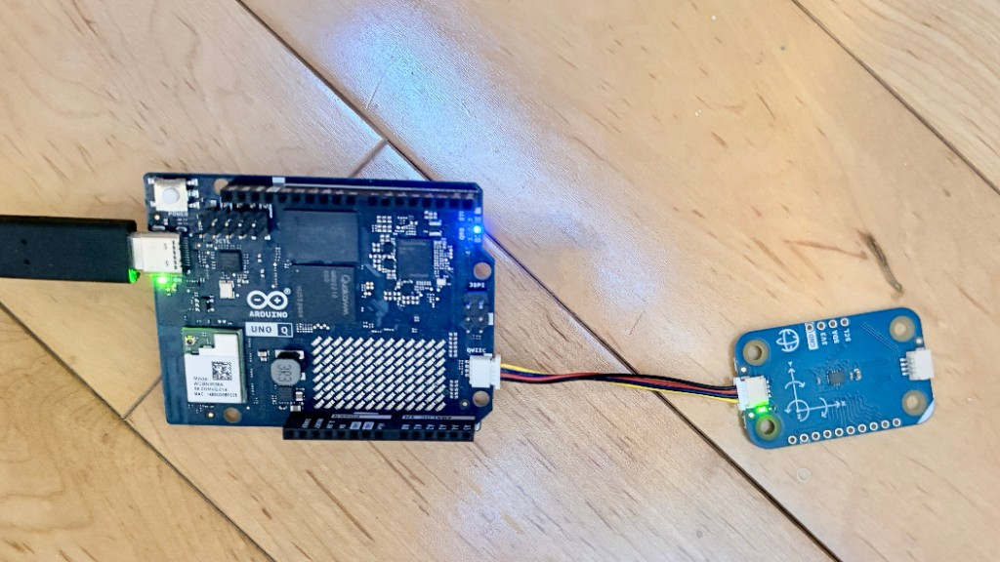
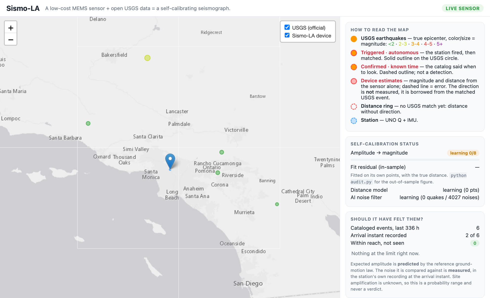

# Sismo-LA — a home seismograph that learns from the official earthquake list

[English](README.md) · [Français](README.fr.md)

[](https://doi.org/10.5281/zenodo.22679542)
[](https://github.com/Medialoco/sismo-la/releases/latest)
[](LICENSE)
[](https://medialoco.github.io/sismo-la/)

Sismo-LA is a small station in a house in Los Angeles County. It runs on USB-C
and WiFi, for about $80. Its MEMS accelerometer — a chip from the same family
as a phone's tilt sensor — measures vibrations in the ground and the building.

The [USGS catalog](https://earthquake.usgs.gov/) is the official list of
earthquakes in the region. A few minutes after each event it publishes
magnitude, location, depth and exact origin time. Above about M1.5 here, it
also lets one say that **no other earthquake occurred**. That second fact is
what makes a silent station checkable.

The station compares *what this box measured* with *what USGS reports*. An
empty detection list then has three readings: nothing was close enough; the
station is blind; or it has stopped. Distinguishing those three is the point of
the project. Matches, when they exist, would fit a model for this sensor on
this shelf in this building. That model still has **0 of 8** points.

Question under test:

> Can a node at that price detect an earthquake and estimate its magnitude,
> unattended and without manual calibration?

**Short answer, 8 September 2026:** not yet for autonomous detection. The
station has found no earthquake by itself. It has confirmed one earthquake by
reading its stored record at the time USGS provided, and it has published a
first case where its own model said it should have seen an earthquake but
found no trace. Publishing that failure is the main result.

### How to read this project

Three questions, in that order: **what can the sensor see?**, **what happened
when an earthquake occurred?**, and **can the station recognize its own
mistakes?**

The numbers below are of three kinds. A **measurement** comes from the
sensor. A **prediction** comes from a model (how large a catalog earthquake
should have been here). A **control** is the same test run at a time when no
earthquake occurred. A **confirmation** is a measurement taken at a second
USGS pointed to; it is not a detection.

Live page: <https://medialoco.github.io/sismo-la/>. The node appears there as a
**20 km disc over the San Fernando Valley**; its position is not published. A
second node is another row in `web-remote/stations.json` with its own snapshot
file.

A technical report on the method and the measured results is published on Zenodo,
[10.5281/zenodo.22679542](https://doi.org/10.5281/zenodo.22679542); see [Publication](#publication) below.



*4 September 2026, somewhere in the San Fernando Valley. Arduino UNO Q and
Modulino Movement, USB-C power.*



*Operator dashboard, live, 4 September 2026. Circles are USGS events. The three
models on the right all read **learning**: 0 of 8 calibration points, 0 distance
points, 0 quakes against 4027 noises. Below them, the station's own audit over
336 hours: 6 cataloged events, 2 with a recording at the arrival instant, 0
within reach and unseen. The pin is a downtown-LA placeholder; the dashboard is
LAN-only and plots the real position.*

## Terms used below

Magnitude describes the size of an earthquake at its source. PGA describes the
acceleration received at this station. Two earthquakes with the same magnitude
can produce very different PGA values depending on distance, depth and local
ground. Do not read PGA as magnitude, or compare the two without stating the
distance.

| Term | Meaning here |
|---|---|
| **Station / node** | This one box: Arduino UNO Q + MEMS module + power + WiFi. |
| **Catalog** | USGS official list of earthquakes. It says which events happened, and above ~M1.5 here, that no other one did. The station does not belong to that network and cannot change it. |
| **MCU** | The real-time microcontroller (STM32). It reads the sensor 100 times per second and decides when a shake starts. |
| **Linux side** | The board’s application processor. It talks to USGS, stores records, fits models, serves the dashboard. |
| **PGA** | Peak ground acceleration: the largest acceleration in a shake, in *g* (1 g ≈ 9.8 m/s²). Footsteps in this house are a few thousandths of a g. |
| **STA/LTA** | An alarm that compares *now* (0.5 s) with *usual* (10 s). When the ratio jumps, the MCU declares an event. There is no fixed “fire at 0.01 g” line; the floor moves with the recent noise. |
| **Blind trigger** | STA/LTA firing on its own, with no help from the catalog. |
| **Envelope** | A 1 Hz outline of the filtered motion (0.7–12 Hz): one max and one average per second. One CSV file per UTC day. Enough to look *back* at a second the trigger missed. |
| **z** | How unusual the envelope is compared with the minutes just before, in units of that site's own scatter. z = 4.0 is the confirmation threshold. |
| **Control** | The same search, at a time when no earthquake occurred. If it still crosses the threshold, that is a false confirmation. |
| **Calibration** | Fitting `magnitude ≈ a·log10(PGA) + b·log10(distance) + c` on matched examples. Eight matches before the amplitude model is treated as usable. Coefficients belong to this installation. |
| **Strong-motion** | Sensitive to nearby, felt-scale shaking. This node does not record distant (teleseismic) earthquakes. |

### The one scale to keep in mind

Everything below is in **mg**, a thousandth of *g*. Three measured numbers set
the whole problem:

| | amplitude | what it is |
|---|---|---|
| Sensor's own electrical noise | **0.36 mg** | the floor. Nothing quieter than this can ever be seen. |
| Trigger threshold, site at rest | **3.08 mg** | 8.55 × the noise of that instant. |
| One adult footstep on the floor | **4 – 11 mg** | fires the trigger easily. |
| The M3.2 earthquake this station recorded | **1.1 mg** | never came close to firing it. |

Household noise exceeds the recorded earthquake by **a factor of eight**. The
blind trigger has consequently never caught an earthquake, and a second channel,
guided by the catalog, does that work instead.

## Two channels that must stay separate

A MEMS chip cannot tell an earthquake from a slammed door. The catalog can, so
the station looks at the ground two ways and keeps two counts.

| Channel | What happened | May train the amplitude model? |
|---|---|---|
| **Detection** | The blind STA/LTA trigger fired by itself. If USGS later has an earthquake at that second, the pair (PGA, catalog M and distance) is a calibration example. | yes |
| **Confirmation** | USGS published an origin time. The station computed when the waves should have arrived and read the stored envelope there. If the envelope is elevated (z ≥ 4), the ground moved. The station did not find that second on its own. | no |

Confirmations are excluded for three separate reasons. They are *selected* for
being a large excursion next to the noise, so their PGA is biased high, and the
events that delivered nothing supply no point at all — the sample is truncated
on exactly the side the model needs. The distance is circular: it comes from the
catalog that also supplies the target magnitude, and it is what locates the
window the PGA is read from. And it is a different quantity — a trigger measures
a peak over 0.5 s at 95 Hz, the envelope a sliding mean over 5–20 s at 1 Hz.

The separation is structural rather than a setting: no code path in the
retrospective loop calls `add_point`. Only a blind trigger matched to a catalog
event feeds the models.

The journal, the dashboard and the public page keep two lists.

## How a cycle runs

1. **Feel.** The MCU runs STA/LTA. On a trigger it sends three numbers over the
   on-board Bridge: PGA, duration, dominant frequency.
2. **Ask.** Linux queries USGS FDSN in a 160 km radius. The map shows events
   down to M0.5; a match used for calibration must be ≥ M2.
3. **Label.** Same second as a catalog earthquake → one training pair. No
   catalog event → a noise example (truck, footsteps).
4. **Fit.** Three models update on every example. Once they have enough points
   they are stored on disk and work offline.

| Model | Input → output | Usable after |
|---|---|---|
| Amplitude calibration | log10(PGA), log10(distance) → magnitude | 8 earthquake matches |
| Distance model | duration, dominant frequency → epicentral distance | 5 matches |
| Noise filter | PGA, duration, frequency → P(this is an earthquake) | 3 earthquake + 3 noise |

Details: [`docs/calibration.md`](docs/calibration.md).

**Retrospective search.** Independently of the trigger, the station records the
envelope all the time. When USGS publishes an origin, the station re-reads the
few seconds when the S-wave should have arrived (a few tens of seconds later,
depending on distance). That is a handful of windows per earthquake, against
about 170 000 blind STA/LTA windows per day, so the test can sit closer to the
noise and average over the wavetrain. On this station’s own noise the extra
reach is a **factor 7–8 in amplitude, one magnitude unit**.

**The catalog gets revised, so the search re-reads it.** An automatic solution
can change hours or days later: `ci41540608` went from M3.36 to M3.20 at 78.5 h.
A revision can move the arrival window (origin time, distance, depth) or the
amplitude check (magnitude), so a verdict can appear or disappear. Every catalog
event is re-scanned in full for as long as its envelope survives, 14 days. An
earthquake first announced under M2 and later revised above it is examined,
rather than counted as a miss.

## Status (9 September 2026)

The station is autonomous: own power, WiFi, no attached computer, no shell
required. It publishes a JSON snapshot every 20 minutes. If nothing changed, it
still sends a heartbeat after 4 hours so the public page can tell a quiet night
from a dead publisher. After a real unplug, the dashboard answered in
**4 min 24 s**. A later 5 h 43 min outage showed the MCU restarting from its
own flash.

**Amplitude calibration: 0 of 8.** **Autonomous detections of earthquakes: 0.**
One cataloged earthquake has been **confirmed** in the envelope (next section),
and one was **flagged by the station as one it should have seen and did not**
([the first miss](#the-first-miss-6-september-2026)) — a verdict a catalog
revision has since withdrawn.

The station's counter now reads **2 confirmed**. Only one is real. The second,
on the evening of 8 September, is a measured false confirmation
([below](#the-second-crossing-is-a-false-confirmation)).

## Confirmation: `ci41540608`

USGS event M3.2, Ontario, California, 2 September 2026, 12:37:12 UTC.

| Quantity | Value | Reading |
|---|---|---|
| Envelope z | 4.34 (threshold 4.0) | the trace sat 4.34 dispersions above the previous minutes |
| Peak / baseline | 0.001095 g / 0.0003816 g | about 3× the quiet level, still a small acceleration |
| Window / lag | 20 s, 24 s after origin | 24 s is a normal S-wave travel time at this distance |
| Blind STA/LTA | needed ~0.0033 g; did not fire | the trigger wanted ~3× the amplitude that arrived |
| Site | at rest | sensor electrical noise; nobody walking above the box |
| Calibration counter | still 0 of 8 | a confirmation is not allowed to increment it |

One event, not a rate, and z = 4.34 is a thin margin over 4.0.

**How often the second channel is fooled, now measured on the recorded
envelope.** A rate of 1 in 1 200 had been computed on *pure sensor noise*. This
house also produces footsteps, so the same search was replayed at 3 585
**control** instants — five complete UTC days, times when no earthquake
occurred. It reaches z = 4.34 in **18% of them, one in six**. The rate tracks
occupancy: 2–3% in an empty house, 20–40% with someone home.

Those false hits have a median peak of **10 mg** (footsteps). This earthquake
peaked at 1.095 mg, below the trigger floor. Requiring both z ≥ 4.34 *and* a
peak that small leaves **1.81%, one in 55**. That is the number that applies
here. Replaying the search at neighbouring hours of 2 September still gives
29% of controls at least as strong. Method and the per-day table: the
report's §10.4.

### The second crossing is a false confirmation

That rate was measured on the morning of 8 September 2026. The same evening the
channel crossed its threshold, and the station has published **2 confirmed**
since. The second one cannot be real, and showing why needs no threshold at all.

USGS event M2.33, Johannesburg swarm, 9 September 2026 01:46:03 UTC
(8 September, 18:46 local).

| Quantity | Value |
|---|---|
| Envelope z | 4.02, threshold 4.00 — a margin of 0.02 |
| Expected shaking, from the frozen law at the public pin | **0.0108 mg** |
| Sensor electrical noise | 0.360 mg |
| So the expected shaking is | **33× below the sensor's own floor** |
| Recorded RMS / peak | 0.4228 mg / 1.120 mg, i.e. 39× and **103×** the prediction |
| Amplitude veto | passed: it tolerates up to 146× |
| Controls reaching z = 4.02 over the previous 13 h | **5%** |

For that earthquake to merely *reach* the sensor floor, the site would need an
amplification at nearly four standard deviations of the law's scatter. Ontario, the
confirmation that stands, sat at 2.3 and produced 1.095 mg against a 0.44 mg
threshold.

The crossing is also fragile. z = 4.02 comes from the station's real position;
replayed from the public pin, 1.4 km off on this geometry, the same search returns
**z = 3.29**. A kilometre shifts the arrival window by seconds, and that is enough
to cross back under the threshold.

The house was quiet at the time — median 0.378 mg, hourly peak maximum
1.16 mg — so this is not a footstep but ordinary envelope jitter on the 5 s
window. Its 1.120 mg peak even clears the tightened 1.2 mg ceiling, so it sits
in the residual 1-in-55 class rather than the coarse 1-in-6 one.

Read the public counter as **the number of times the criterion was crossed**,
not the number of earthquakes recorded. The criterion is fixed, frozen since
1 September, and wrong at a measured rate; nothing was tuned in response to
this event.

## Noise floor: the wall is the sensor

The noise floor is the level the instrument shows when nothing is moving.
Anything weaker is invisible, permanently, so what sets that floor decides what
the station can be: the building, the street, the software, or the chip.

On 1 September 2026 the at-rest noise was estimated in **two independent
frequency bands over the same ten seconds**, and compared with the LSM6DSOX
datasheet. Using the same ten seconds for both matters: neither figure then
depends on comparing one night with another.

| Band | Measured | Datasheet prediction | Gap |
|---|---|---|---|
| 0.7 – 12 Hz (the seismic band) | **0.00036 g** | 0.00040 g | 10% |
| wideband | **0.00052 g** | 0.00050 g | 4% |

The floor is the **sensor's own electrical noise**. To within 4–10%, this station
is as quiet as the chip allows.

The noise is *white* — spread evenly across frequency — and falls inside the
seismic band, so the only bandwidth left to remove is bandwidth an earthquake
needs. The band-pass already took the 1.43× available, and no further filtering
lowers the floor. A lower autonomous threshold needs a quieter chip, or several
chips
([`docs/sensor-upgrade.md`](docs/sensor-upgrade.md)).

## How large an earthquake it can catch

STA/LTA is a *ratio*, so there is no fixed line in g. What is fixed is the
ratio between the threshold and the noise the long average is tracking. Two
measurements pin it down:

- the smallest peak that ever fired this station is **0.0044 g** before the
  band-pass, i.e. **0.00308 g (3.08 mg)** after it — the band-pass lowers the
  floor by a measured 1.43×, and a ratio detector's floor follows;
- the at-rest floor is **0.00036 g**, shown to be the sensor's own electrical
  noise (see [Noise floor](#noise-floor-the-wall-is-the-sensor)).

Their quotient is **8.55**, the only free parameter here:

```
trigger floor = 8.55 x (the envelope level measured at that instant)
retro floor   = trigger floor / 7.4
```

That is predictive: given the noise at any second, you know what it would have
taken to fire at that second. Passed through the ground-motion law below, the
floor becomes a **required magnitude** at a given distance (±0.45 at 1σ). Below
M3 the numbers are extrapolations:

| Required magnitude | 10 km | 30 km | 50 km | 100 km | 160 km |
|---|---|---|---|---|---|
| Blind trigger | 3.1 | 3.9 | 4.3 | 4.9 | 5.3 |
| Retrospective search | 2.1 | 2.9 | 3.3 | 3.9 | 4.3 |

Those thresholds, crossed with the **2 016** real USGS events of M ≥ 2 within
160 km over five years — counted from the public city-scale pin, so the figure
is reproducible from public data — and the law’s 0.39 log10 scatter, with
unknown site amplification ×1 to ×4:

| | earthquakes / year | mean wait | P(at least one before 13 Sep 2026) |
|---|---|---|---|
| Blind trigger only | 2.0 – 9.8 | 37–184 days | 6–28% |
| Trigger + retrospective search | 9.9 – 36.9 | 10–37 days | 28–70% |

The retrospective row assumes the house is at rest (about half the hours here).
In a busy hour the envelope wanders by about ×4; in a quiet hour, ~3%. Envelope
files exist from 1 September 2026; earlier hours cannot be searched.

## Ground-motion law

A **ground-motion law** predicts PGA from magnitude and distance. The station
uses the same algebraic form the other way: given PGA and distance, estimate M.
The coefficients were fitted on **12 324 PGA values** actually recorded by USGS
ShakeMap stations during 40 southern California earthquakes (M3.03–5.51,
3–200 km, 1 006 stations):

`log10(PGA in g) = 0.867·M − 1.740·log10(R in km) − 3.305`

scatter 0.390 log10, R² = 0.80. An earlier coefficient set over-predicted
amplitude by 37.9× (about two magnitude units).

## Does silence mean “broken” or “nothing happened”?

An empty detection list is the usual answer, not a fault by itself: **96.9 %**
of the M ≥ 2 catalog within 160 km over five years sits below both channels
(report, fig. 2). For every cataloged earthquake the station still (1) predicts
the PGA the law says should have arrived, and (2) reads the noise it was
actually sitting in at that second. Five classes:

| Class | Meaning |
|---|---|
| Out of reach | expected PGA below what this site can see; the normal case |
| Marginal | close to the floor; do not treat as a miss |
| Triggered | blind STA/LTA fired and matched |
| Confirmed | envelope elevated at the predicted arrival |
| Should have been seen | in reach, site quiet enough, nothing in the record → a fault |

**19 examined, 1 confirmed, 0 should have been seen** — 30 days to 2 September
2026. The same three counts are published continuously over the last 336 hours,
in [`station.json`](https://medialoco.github.io/sismo-la/station.json) under
`expected.summary`: *examined / recorded / missed*. Recorded means the envelope
exists at that second, not that the event was confirmed.

Neither public page draws them. Printed bare, `7 · 2 · 0` reads as a score of 2
out of 7, which inverts the meaning, and the counts are only informative next to
their definitions. They stay complete in the snapshot the pages read. Which
events were in reach stays on the station LAN. Method:
[`docs/expected-vs-observed.md`](docs/expected-vs-observed.md).

### The first miss, 6 September 2026

That last count left zero for the first time. An M3.2 at 07:13:11 UTC was close
enough that the ground-motion law put the expected shaking **above the 0.44 mg**
the retrospective channel could have reached at that moment, with better than even
odds of catching it assuming no site amplification at all. The audit therefore
returned *should have been seen* and published that against the station,
unprompted, 32 minutes after the earthquake. The predicted amplitude itself is not
printed here: the law inverts, so that number next to the published magnitude
would give the distance, and a second ring beside the one from 2 September would
place the station.

Reading the record afterwards says what happened. The envelope is continuous
across the whole arrival window, with no gap, and the second-by-second trace for
a minute either side is indistinguishable from the minute before: the median rms
rises by **0.5%**, against **6.4%** for the confirmed event, and the strongest
single second of the two-minute span falls *before* any wave could have arrived. The significance test returned **z = 2.9**
against its threshold of 4, and no averaging window between 2 s and 30 s gets it
past 3.05. The shaking is simply not in the record, and the prediction sat on the
optimistic side of a law whose ordinary site-to-site scatter is a factor 2.45.

The one confirmation sits at the other end of the same scatter. Ontario, on
2 September, was the same magnitude at nearly twice the distance and delivered
**7.8×** its predicted amplitude. Compton, closer, delivered nothing above the
ambient level. The two bracket the site-to-site scatter with the station's own
data, and place the single confirmation on its favourable tail.

**The verdict was withdrawn on 9 September, and no measurement changed.** USGS
revised the event from M3.2 to **M3.07** and relocated it slightly deeper. Both
corrections lower the predicted amplitude, so the pessimistic bound of the
detection probability fell from 0.57 to **0.432**, under the one-in-two line that
defines *should have been seen*, and the station reclassified it **marginal**. Its
audit reads zero missed again. The relocation also moved the arrival window, which
lifts z from 2.90 to 3.54 — still under 4. The envelope still holds no trace of
this earthquake; what moved is the verdict, because the catalog is not a fixed
reference. Read the audit counts with their date; the mechanism is under
[Retrospective search](#retrospective-search).

Three ways of showing the miss on the public pages were tried and dropped: the
status badge, which made a working audit and a dead sensor look identical; a
captioned line on the front page; then all three counts defined on the data page.
Each still required a paragraph of definitions before a bare integer stopped
misleading a visitor. The counts remain in
[`station.json`](https://medialoco.github.io/sismo-la/station.json), complete and
timestamped, every 20 minutes.

## Other measurements

| Observation | Value |
|---|---|
| Trigger rate after moving the box from a desk to a stiffer mount | 22.6 → 3.2 events / h (−86%). Noise floor 0.00087 → 0.00066 g (−24%). Coupling dominates false triggers. |
| Power-on → dashboard answering | 4 min 24 s. A watchdog sidecar restarts the container; App Lab otherwise stops it one second after boot. |
| Dominant frequency (after a sign bug: centered vs uncentered sample) | real taps at 2.6 / 5.0 / 10.6 Hz. The bug had printed ~25 Hz on every signal. |
| Median envelope peak per day, 1–8 September | 0.721 – 0.784 mg, a 4% spread over eight full days. Blind triggers over the same days ran 0 to 3112, and the daily maximum 1.4 to 24 mg. The trigger count tracks whether anyone is home, not the noise floor: 4–6 September fired nothing at all. |

The only independent “the sensor is alive” signal is the MCU heartbeat (~10 s).
A 200 from the web dashboard means the Linux process is up. `health.stale`
drives the public badge and a `STATION DEGRADED` banner.

## Replay: a software test

`python main.py --replay` pulls the real catalog for the last 24 hours and
*invents* PGA from magnitude and distance using the *old* (pre-refit) law, so
the fake amplitudes are 38× too large. That is on purpose: corrected values
would sit under the trigger and the demo would show nothing. The calibrator
then fits the inverse of that same law. Residuals in replay test the pipeline;
they are circular and carry no physical meaning.

The dashboard RMSE is an **in-sample** residual (the model scored on points it
already fitted) and it is given the *true* catalog distance. Live operation
gets only an *estimated* distance. `python audit.py` walks the journal in time
order and scores each point with the model *as it was before that point*
(out-of-sample, prequential):

| Estimator | run A (11 pts) | run B (27 pts) |
|---|---|---|
| In-sample, true distance (what the panel shows) | 0.20 Mw | 0.18 Mw |
| Out-of-sample, true distance | 0.30 Mw | 0.21 Mw |
| Out-of-sample, estimated distance (live path) | 1.10 Mw | 0.26 Mw |

At 11 points, 1.10 Mw is dominated by the first predictions, when the model had
almost no data. The table documents the scoring method.

## Limits

- The station reports earthquakes that have already occurred. It does not
  forecast.
- Move the box and the coefficients are wrong until they are fitted again.
- One PGA is a noisy stand-in for released energy. ±0.3–0.5 magnitude is the
  realistic ceiling even with a good fit.
- Strong-motion only. No teleseisms.
- The method needs a busy region and a catalog that publishes within minutes.
  Southern California is close to that case.

## Cost (prices 1 September 2026)

| Part | Price | Source |
|---|---|---|
| Arduino UNO Q 2 GB (ABX00162) | $59.00, or $44.00–45.20 | store.arduino.cc; DigiKey, PiShop, Farnell |
| Modulino Movement (ABX00101, LSM6DSOX) | $11.80 | store.arduino.cc |
| USB-C supply, 5 V / 3 A | ~$15 | commodity, estimate |
| **One node** | **$71–86** | ~$90 with tax and shipping |

Raspberry Shake the same day: $294.99 board, $584.99 turnkey
([raspberryshake.org](https://raspberryshake.org/pricing)). Full list:
[`docs/hardware.md`](docs/hardware.md).

## What three stations would add (geometry, not a result)


The firmware stores the *magnitude* of the acceleration vector, so direction is
discarded. The P-wave (the arrival whose polarization points at the source) is
below this trigger. One station therefore yields a **distance**, which is a
ring on the map. Three rings would intersect. Each node would still fit its own
coefficients against the catalog. This has not been built: one station, one
confirmation, zero autonomous detections.

## Run it without hardware

Replay uses the real catalog and synthetic amplitudes (see above).

```bash
cd python
python3 -m venv .venv && source .venv/bin/activate
pip install -r requirements.txt
cp config.example.yaml config.yaml

python main.py --replay       # then http://localhost:8000
python audit.py               # out-of-sample residuals from the journal
python audit.py --include-synthetic
```

`python main.py --mock` invents shakes. `python main.py` talks to a real sensor.
On the board this folder *is* an [App Lab](https://docs.arduino.cc/) App:

```bash
arduino-app-cli app start ~/ArduinoApps/sismo-la
arduino-app-cli app logs  ~/ArduinoApps/sismo-la
```

## Architecture

```
                     Arduino UNO Q
 ┌───────────────────────────┬────────────────────────────────┐
 │   STM32U585 (MCU)         │   Dragonwing QRB2210 (MPU)     │
 │   Zephyr RTOS, real time  │   Debian Linux                 │
 ├───────────────────────────┼────────────────────────────────┤
 │ - IMU 100 Hz, LSM6DSOX    │ - WiFi + USGS FDSN             │
 │   Qwiic on Wire1          │   (map ≥ M0.5, matches ≥ M2,   │
 │ - STA/LTA 0.5 s / 10 s    │    160 km)                     │
 │ - PGA, duration, f0       │ - correlation, models,         │
 │ - event ──────────────────┼─►  envelope, retro, audit      │
 │   over the Bridge         │ - dashboard + publish          │
 └───────────────────────────┴────────────────────────────────┘
                    USGS: https://earthquake.usgs.gov/fdsnws/event/1/
```

On this board the Qwiic connector is **`Wire1`** (not `Wire`). MCU `Serial` is
pins D0/D1, not USB. The MCU↔Linux Bridge needs matching versions of
`arduino-router` and the bridge library.
[`docs/getting-started.md`](docs/getting-started.md),
[`docs/hardware.md`](docs/hardware.md).

## Publish

`python/main.py` writes a JSON snapshot on a timer (`publish:` in
`config.yaml`). [`web-remote/`](web-remote/) draws the map;
[`data.html`](web-remote/data.html) is the tables. The snapshot contains
**no coordinates**. Set `publish.include_location: true` to plot the station.

Anything derived from the station's position can locate the house: a list of
distances, a list of detection probabilities, or even the set of earthquakes
drawn on the map (a 160 km disc traces its own edge). Those fields are therefore
removed or re-centred on `publish.map_center`, the city-scale pin the roster
already publishes. Without that setting the station's position is snapped to a
quarter degree.

The journal (`event_log.jsonl`) and the model files live on the host disk, next
to the container, so they survive restarts.

## Layout

```
sismo-la/
├── app.yaml                   # App Lab manifest
├── python/                    # Linux half (Dragonwing)
│   ├── main.py                # loops, dashboard, publisher
│   ├── pipeline.py            # detection / correlation
│   ├── usgs.py                # USGS catalog client
│   ├── calibration.py         # amplitude + distance models
│   ├── classifier.py          # earthquake-vs-noise filter
│   ├── envelope.py            # continuous envelope (one CSV / UTC day)
│   ├── retro.py               # look back at the catalog arrival time
│   ├── expected.py            # expected vs observed
│   ├── audit.py               # out-of-sample score from the journal
│   └── dashboard/index.html   # operator dashboard
├── sketch/                    # MCU half (STM32, Zephyr)
├── deploy/                    # watchdog that restarts the container
├── docs/
└── web-remote/                # public page on GitHub Pages
```

## Checklist

- [x] Autonomous node: detect → match to USGS → learn → publish.
- [x] Recovers from a power cut (4 min 24 s).
- [x] Trigger floor and expected rates measured.
- [x] Ground-motion law refit on 12 324 ShakeMap PGA values.
- [x] Continuous envelope + retrospective search (factor 7–8 in amplitude),
      counted separately from detections.
- [x] First confirmation (`ci41540608`, M3.2, 2 September 2026). Blind trigger
      needed ~3× the arrived amplitude. Its false-confirmation rate is now
      measured on real recordings, not simulated noise: one in 55.
- [ ] First autonomous detection: none. Amplitude calibration 0 of 8.
- [x] Catalog audit, which returned its first `missed` against the station on
      6 September and published it unprompted.
- [ ] Calibration curve from real recordings, held-out residuals.
- [ ] Contest video: replay + a live tap on the box (around 8 September 2026).
- [x] Technical report deposited on Zenodo, [10.5281/zenodo.22679542](https://doi.org/10.5281/zenodo.22679542) (9 September 2026).

Entry in
[Invent the Future with Arduino UNO Q and App Lab](https://www.hackster.io/contests/invent-the-future-with-arduino-uno-q-and-app-lab),
**Best Social Impact**, submissions close **13 September 2026**. Video storyboard:
[`docs/hackster-story.md`](docs/hackster-story.md).

## Publication

A technical report describes the method and the measured results in full. The
Zenodo record holds both language versions, English and French, at full parity —
same sections, same figures, same numbers — together with the archive that
reproduces every figure and every number from the station's raw envelopes.

> Prieur, B. (2026). *Can a seismic station built on a $12 motion sensor be
> falsifiable? Measured sensitivity, retrospective channel, and continuous
> self-audit of a MEMS station in Los Angeles.* Zenodo.
> <https://doi.org/10.5281/zenodo.22679542>
>
> ORCID: [0000-0003-0786-0049](https://orcid.org/0000-0003-0786-0049).

The report is not a rewrite of this README. It asks a narrower question — whether
a station at this price can publish, unattended, enough for a third party to
establish that it was wrong — and answers it with five figures and the numbers
behind them:

| The report establishes | Where it appears here |
|---|---|
| Noise floor measured in two frequency bands, 4–10 % from the datasheet | [Noise floor](#noise-floor-the-wall-is-the-sensor) |
| Trigger threshold at 8.55 × instantaneous ambient noise, and the magnitudes that follow | [How large an earthquake it can catch](#how-large-an-earthquake-it-can-catch) |
| Retrospective channel worth exactly one magnitude unit (factor 7.4) | [Two channels](#two-channels-that-must-stay-separate) |
| The 2 September confirmation, reproduced from raw envelope data | [Confirmation](#confirmation-ci41540608) |
| False-confirmation rate measured on 3 585 control windows: one in six on significance alone, one in 55 with the amplitude condition — and one occurred on 8 September | [Confirmation](#confirmation-ci41540608) |
| Six-verdict audit against the catalog, which returned a first miss against the station and then withdrew it on a catalog revision | [Does silence mean “broken”?](#does-silence-mean-broken-or-nothing-happened) |
| Four claims in this documentation that the data corrected | — |

Its figures and numeric checks come from a single script that **imports this
repository's estimator** rather than reimplementing it, so the verification
applies to the code the station actually runs. Inputs are the station's raw
envelope, five complete UTC envelope days, a USGS catalog query and the public
snapshot.

## License

MIT — [`LICENSE`](LICENSE).
