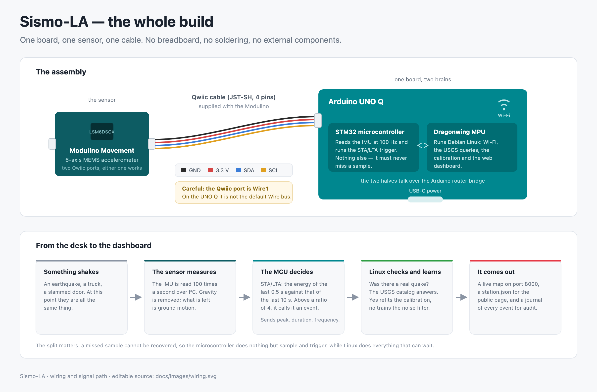

# Hackster story draft (English) — ready to paste

Draft for the project page on hackster.io, following the structure in
`hackster-submission.md`. Update the numbers before submitting.

---

## Name

**Sismo-LA: a seismograph that learns from real Los Angeles earthquakes**

## Pitch

A self-calibrating earthquake sensor for the Arduino UNO Q: it compares every
shake it feels with the official USGS catalog, learns its own transfer
function, and gets more accurate with every quake — no lab equipment needed.

## Categories (max 3)

Monitoring · Data collection · Social impact

## Difficulty

Intermediate

## Things

- Arduino UNO Q (4 GB)
- Arduino Modulino Movement (ABX00101, LSM6DSOX IMU) + bundled Qwiic cable
- USB-C to USB-C data cable (or a USB-C power supply for standalone use)

---

## Story

### 1. The problem: seismology is expensive, Los Angeles is not waiting

Los Angeles sits on one of the most active fault systems in the world. Over the
91 days from June to August 2026 the USGS cataloged **2,136 earthquakes within
160 km of downtown** — about 23 a day, most far too small to feel, some very
much not. Professional
strong-motion stations cost thousands of dollars; community projects like
Raspberry Shake still start around $400. Meanwhile a MEMS accelerometer costs
a few dollars and ships in every phone.

The catch: a cheap MEMS sensor out of the box tells you *something shook*, not
*how big it was* or *how far away*. It is uncalibrated. Calibrating an
instrument normally requires a reference — a shake table, a co-located
professional station, a lab.

### 2. The key idea: the ground truth is free

In Los Angeles, the reference already exists and it is free: the **USGS
earthquake catalog**, updated within minutes, with magnitude, location and
depth for every event. So instead of calibrating the sensor in a lab, the
device calibrates itself in place:

1. The sensor detects a shake and measures its amplitude (PGA), duration and
   dominant frequency.
2. The Linux side queries the USGS API: *was there a real earthquake near me
   just now?*
3. If yes — that pair (my measurement ↔ official magnitude and distance) is
   one calibration point.
4. A regression over these points becomes the device's own, site-specific
   transfer function: `magnitude ≈ a·log10(PGA) + b·log10(distance) + c`.

Every earthquake makes the device better. And the same loop labels training data
for an AI noise filter — for free.

**How fast does it actually converge?** I checked rather than guessed. Querying
the USGS count API for the 91 days from June 1 to August 31, 2026, within 160 km
of downtown Los Angeles:

| | 160 km | 80 km | 50 km |
|---|---|---|---|
| M ≥ 0.5 | 2136 | — | — |
| M ≥ 2.0 | 110 | 26 | 13 |
| M ≥ 2.5 | 33 | 5 | 1 |
| M ≥ 3.0 | 12 | 2 | 0 |

The amplitude model needs 8 confirmed matches. If the sensor can detect M2 events
out to 160 km, that is 110 per quarter — about a week to converge. If it can only
feel M2.5 within 50 km, that is *one event per quarter*, and convergence takes
years.

Those two answers differ by a factor of a hundred, and the difference is exactly
the sensor's true detection threshold — which is the one quantity I have not yet
measured. So I am not going to claim a convergence time. Measuring that threshold
on real recordings is the next step, and it is the honest crux of the project.

### 3. Hardware: two brains, one Qwiic cable, zero soldering

The Arduino UNO Q is two computers on one board:

- an **STM32U585 MCU** (Zephyr RTOS) — the real-time brain that never misses
  a shake;
- a **Qualcomm Dragonwing QRB2210 MPU** (Debian Linux) — the connected brain
  that talks to USGS, learns, and serves the dashboard.

The only wiring is the Modulino Movement plugged into the UNO Q's Qwiic
connector with the 5 cm cable that ships in the box. Mount the sensor rigidly
to a solid surface (concrete floor, load-bearing wall) — coupling quality is
the real "antenna" of a seismograph.

> Gotcha worth knowing: on the UNO Q the Qwiic connector is on `Wire1` (not
> `Wire`), and the MCU's `Serial` goes to the D0/D1 header pins, not to USB.
> MCU-to-Linux communication goes through the Bridge (Arduino's RPC router).

### 4. The real-time side: STA/LTA, the classic that still works

The MCU samples the IMU at 100 Hz, removes gravity with a slow low-pass
filter, and runs **STA/LTA** — the trigger algorithm real seismic networks
have used for decades. A short-term average (0.5 s) of the signal energy is
compared with a long-term average (10 s): when the ratio exceeds 4, an event
starts; when it falls below 1.5, the event ends. The LTA freezes during an
event so the earthquake does not contaminate its own noise floor.

For each event the MCU emits one compact JSON message over the Bridge:
peak acceleration (g), duration (ms), dominant frequency (Hz).

### 5. The Linux side: correlate, learn, serve

A Python application on the Dragonwing:

- polls the USGS FDSN API every 60 s (radius 160 km, M ≥ 0.5 for context,
  M ≥ 2.0 for calibration);
- matches local events to cataloged quakes within a time window that absorbs
  wave propagation and USGS publication delay;
- updates **three models** on every confirmed match:
  - amplitude → magnitude (the core calibration),
  - duration + frequency → epicentral distance (so a single station can
    estimate *where*, not just *how big*),
  - an online logistic-regression **noise filter** (earthquake vs truck).

The noise filter needs no offline training set: USGS-confirmed events are
positive samples, unmatched shakes are negatives. The device literally learns
what *its* neighborhood's earthquakes feel like versus *its* street's trucks.

### 6. The dashboard: red circles vs the truth

The web dashboard (served by the board) shows one map with two layers:

- **USGS earthquakes** — colored circles at the true epicenters (the ground
  truth);
- **the device's own estimates in red** — where and how big the sensor alone
  thinks each quake was, with a dashed error vector to the true epicenter.

Watching the red circles converge toward the colored ones as calibration
accumulates *is* the story of this project, live on screen. A side panel
shows every detection with the verdict (`✓ confirmed by USGS`, `✗ local
noise`, `? awaiting USGS`) and the running comparison
(`device ~M1.4 vs USGS M1.5 · dist ~84 vs 83 km · AI 97% quake`).

A **replay mode** re-plays the last 24 h of the real USGS catalog as if the
sensor were detecting each quake live — so the demo works even on a quiet
afternoon.

### 7. Results (updating as the station accumulates data)

Calibration becomes usable after 8 confirmed matches, the distance model after
5, and the noise filter after 3 examples of each class. In replay validation the
whole chain runs end-to-end and converges as designed.

One caveat I want to state myself rather than have you wonder about it: in
replay mode the sensor readings are **synthesized** from cataloged magnitude and
distance through an attenuation law, and the calibration then fits the inverse
of that same law. So the replay figures demonstrate that the *software* is
correct — correlation, matching, fitting, persistence, inference — and they are
partly circular by construction. They are not a measurement of how accurate the
*instrument* is.

The honest number for the instrument requires real recordings of real
earthquakes at a fixed installation, with residuals reported on events held out
from the fit. That campaign is running now.

- [ ] TODO: first real correlated M2+ earthquake (screenshot + USGS event ID).
- [ ] TODO: calibration curve from real recordings after N days.

### 8. Limits, honestly

- **It detects, it does not predict.** The device characterizes earthquakes
  while they happen. It says nothing about earthquakes that have not occurred
  yet, and makes no attempt to.
- A MEMS IMU senses local strong motion (M ≥ ~2.5–3 nearby), not teleseisms.
  This is a neighborhood strong-motion node, not a broadband observatory.
- Cut the network and the station keeps working — the models are on disk — but
  with no matched catalog event to borrow an azimuth from, its output becomes a
  distance *ring* rather than a located point. Offline it knows how big and how
  far, not in which direction.
- The calibration belongs to this exact spot: this sensor, this mount, this
  building, this soil. Move it and it must reconverge.
- One station knows distance (from the coda) but not direction: alone it
  draws a circle, not a pin. Three neighbors could triangulate — that is the
  scalability story.
- Magnitude from a single PGA measurement is approximate by nature
  (±0.3–0.5 after good calibration is realistic).

### 9. Why this matters (and scales)

The pattern — **cheap sensor + free open ground truth = self-calibrating
instrument** — is not specific to earthquakes. Air quality (OpenAQ), weather
(NOAA), urban noise: wherever open data exists, a cheap device can bootstrap
itself into a useful instrument. Sismo-LA is the proof of concept, in the
best possible test city.

---

## Media checklist (per submission rules)

- [ ] Cover photo: the assembled device, clean background, 4:3, no text.
- [ ] Macro photo: Modulino on Qwiic.
- [ ] Fritzing schematic.
- [ ] Video: tap the desk → detection appears on the dashboard (live mode).
- [x] Video: replay mode filling the map — `video/calibration-timelapse.mp4`
      (and `.gif`), narration in `video-script.md` + `video/narration.srt`.
- [x] Screenshot: a USGS-correlated event in the side panel —
      `images/timelapse-4-calibrated.jpg`. Replayed catalog data, and the
      badge in the corner says so; do not present it as a live recording.
- [x] Diagram of the principle — `images/how-it-works.png`.
