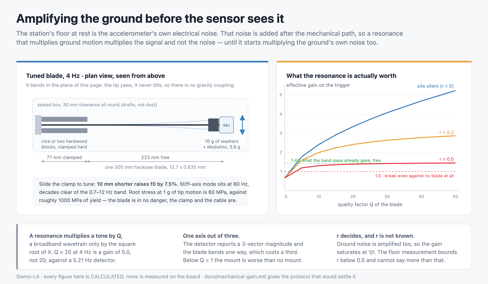

# Mechanical gain: amplifying the ground before the sensor sees it

Written **2026-09-01**. Everything in this document is **calculated**. Not one
number here was measured on the board, and section 7 says exactly which
measurement would settle each of them. Read `AGENTS.md`, "Claims discipline",
before quoting anything from here.



## 0. The question, and the short answer

The station's at-rest noise floor was measured on 2026-09-01 to be the
LSM6DSOX's own electrical noise, in two independent bands, to within 4-10% of
the datasheet white-noise line (`AGENTS.md`, "The seismic band-pass"). Electrical
noise enters **after** the mechanical path. So a mechanism that amplifies ground
motion before the sensor multiplies the signal and leaves that noise alone,
which no amount of gain applied after digitisation can do. The idea is sound.

The honest arithmetic is less exciting than the idea:

| | gain |
|---|---|
| a resonance of quality factor Q, on a **tone** at f0 | Q |
| the same resonance, on a **broadband wavetrain**, against a 5.21 Hz detector | **5.0** at Q = 20, f0 = 4 Hz |
| after the detector's 3-vector magnitude sees only one amplified axis | **3.3** |
| after the resonance also amplifies the ground's own noise, at r = 0.2 | **2.2** |
| the same, at r = 0.5 | **1.4** |

where `r` is the ratio of ambient ground noise to sensor electrical noise in the
band. **`r` has never been measured on this station**, and the floor measurement
that made this whole idea possible cannot bound it better than `r < 0.5`
(section 3). At the pessimistic end of that bound the entire mechanical
amplifier is worth 1.4x, which is what the band-pass already delivered for free.

Meanwhile a lever that costs nothing — putting the station on the top floor of
the building instead of near the ground — is worth **about 3x on both horizontal
axes**, from instrumented-building records, with no build, no waveform
distortion and no change to the pipeline.

**Recommendation in one line: relocate first, build the blade second, and build
it as an instrument to measure `r` rather than as a detector.** Section 9.

## 1. Why the mechanical route is the only one left

`docs/sensor-upgrade.md` closed the software question: the floor is the sensor's
own noise, the band-pass took the 1.43x that was there to take, and the next
real gain is a quieter part. This document asks whether anything purely
mechanical can be had before a part can be ordered, received and soldered.

The chain is unchanged from `tools/sensor-gain.py`: the trigger is STA/LTA, so
the ground amplitude a shake needs in order to fire is proportional to the floor
the LTA tracks. Dividing the effective floor by G is exactly equivalent to
fitting a sensor G times quieter, and it converts to detections per year through
the same refit ground-motion law and the same 2185 real the station's site events.

| effective gain | trigger floor | M@10km | M@30 | M@50 | M@100 | M@160 | detections/year (x1..x4 site) | mean wait | P(one in 12 d) |
|---|---|---|---|---|---|---|---|---|---|
| **x1.0 (today)** | 0.00308 g | 3.1 | 3.9 | 4.3 | 4.9 | 5.3 | **2.0 - 9.8** | 37-184 d | 6-28% |
| x1.5 | 0.00205 g | 2.9 | 3.7 | 4.1 | 4.7 | 5.1 | 3.2 - 15.1 | 24-115 d | 10-39% |
| x2.0 | 0.00154 g | 2.8 | 3.6 | 4.0 | 4.6 | 5.0 | 4.5 - 20.2 | 18-82 d | 14-49% |
| x3.0 | 0.00103 g | 2.6 | 3.4 | 3.8 | 4.4 | 4.8 | 7.1 - 30.0 | 12-51 d | 21-63% |
| x4.0 | 0.00077 g | 2.4 | 3.2 | 3.6 | 4.2 | 4.6 | 9.8 - 39.2 | 9-37 d | 28-72% |
| x6.0 | 0.00051 g | 2.2 | 3.0 | 3.4 | 4.0 | 4.4 | 15.1 - 56.3 | 6-24 d | 39-84% |

Read every magnitude as **+-0.45 Mw (1 sigma)**; below M3 it is extrapolation.
The x1..x4 spread is unknown soil amplification. The x1.0 row reproduces the
published 2.0-9.8/year exactly, which is how the tool was validated.

**The last column assumes the gain is in place today, and no build is.** A gain
that arrives on 5 September only has eight days to work in.

## 2. What a resonance is actually worth

A cantilever excited through its base transmits absolute acceleration to its tip
with transmissibility `T(f)`, and at resonance `T(f0) = Q`. That is where "the
acceleration is multiplied by the quality factor" comes from, and it is true —
**for a sustained sinusoid at exactly f0**. An earthquake wavetrain is not that.

The resonance has a noise-equivalent bandwidth of `(pi/2) f0/Q` and a peak power
gain of `Q^2`, so the power it adds to a broadband input is `(pi/2) f0 Q`,
independent of nothing except the product. The detector integrates
`ENBW = 5.21 Hz` (the 0.7-12 Hz chain, measured value from `AGENTS.md`), so the
power gain seen by the trigger is

```
K = 1 + (pi/2) * f0 * Q / ENBW          amplitude gain = sqrt(K)
```

The amplitude gain therefore grows like **sqrt(Q)**, not Q. At f0 = 4 Hz:

| Q | ring-down (1/e) | broadband gain |
|---|---|---|
| 5 | 0.40 s | 2.65 |
| 10 | 0.80 s | 3.61 |
| 20 | 1.59 s | 5.01 |
| 30 | 2.39 s | 6.10 |
| 50 | 3.98 s | 7.83 |

Conflating the two is the single easiest way to overstate this idea by a factor
of four, and it is why "Q = 50, so a gain of 50" does not appear anywhere here.

### 2.1 What Q is realistic

Three losses matter, and the one people worry about least dominates.

- **Material damping** is irrelevant at this scale. Steel's loss factor is
  1e-4 to 6e-4, i.e. `Q_material` in the thousands. Brass is worse but still in
  the hundreds. The blade is not the limit.
- **Air damping** is real but modest at 4 Hz, where velocities are low for a
  given acceleration.
- **The clamp dominates**, and it is the part a hardware-store build gets wrong.

The most directly transferable measurement found is a macroscopic bimorph
cantilever with a proof mass, in air, measured with a laser vibrometer at 30 Hz:
damping ratios of **0.021, 0.031 and 0.063** for three builds of the same device
(*Structure-performance relationships for cantilever-type piezoelectric energy
harvesters*, doi:10.1063/1.4879876, Table III), i.e. **Q = 8 to 24**. That is a
laboratory fixture, not a vice.

On the clamp specifically, a 1965 NASA report (*Damping Characteristics of Built-Up
Cantilever Beams in a Vacuum Environment*, NTRS 19650027173) measured a solid SAE 4130 steel
cantilever against screw-fastened versions of the same beam and found that slip
damping at the joint is **maximal at low clamping pressure** and falls to zero at
both zero and high clamping pressure. The operational instruction that follows is
blunt: **clamp it hard, or do not clamp it at all**. A blade held by one hand-
tightened wing nut sits near the worst case.

**Expect Q = 10 to 30 from a blade gripped the full width of its section in a
metal vice, and Q = 5 to 15 from wood blocks and C-clamps.** Neither figure is
measured here, and section 7 gives a two-minute way to find out with a phone.

### 2.2 One axis out of three

`pga_g` is the magnitude of the 3-vector. A blade bends one way. Over a
wavetrain the horizontal motion is roughly isotropic in azimuth, so the blade
sees about one horizontal component `H`, where the vector magnitude currently
sees `sqrt(H1^2 + H2^2 + V^2)` which is about `1.5 H`. That is a flat **x0.67**
on everything above, and it has an uncomfortable corollary: **below Q = 1 a
single-axis mount is worse than no mount at all**, and the gain does not cross
break-even until Q is about 1.

### 2.3 The ceiling nobody can raise: the resonance amplifies the site too

Ambient ground noise is ground motion, so the blade lifts it exactly as it lifts
an earthquake. Only the sensor's electrical noise is left behind. With
`r = (site noise)/(sensor noise)` in the band, the signal-to-noise improvement is

```
sqrt(K) * sqrt(1 + r^2) / sqrt(1 + K*r^2)     ->   1/r  as K grows
```

**Every mechanical scheme in this document, of any Q, is capped at 1/r.** So the
whole question is how big r is, and the station's own floor measurement is
barely able to answer it. Measured in-band floor 0.00036 g against 0.00040 g
predicted from the datasheet: the measurement is *below* the prediction, so it is
consistent with the site contributing nothing at all — but that conclusion holds
only as long as the part is close to its datasheet typical:

| if the true noise density is | implied r | ceiling 1/r |
|---|---|---|
| within 10% of 110 ug/rtHz | 0 (site unresolvable) | unbounded by this measurement |
| 15% below | 0.35 | 2.9 |
| 20% below | 0.52 | 1.9 |
| 25% below | 0.66 | 1.5 |

**`r < 0.5` is defensible; `r = 0` is not provable.** This is the crux of the
whole study and it is why the recommendation is what it is: at r = 0.5 the
saturated gain is 1.44, which is the 1.43x the band-pass already gave away for
free, and the blade would be two days of work for nothing.

One argument in the blade's favour: `r` is band-dependent. The 0.00036 g figure
integrates 0.7-12 Hz, and the only place site noise showed up positively in that
measurement was the +4% excess on the *wideband* channel, i.e. between 0.08 and
0.7 Hz. Site noise concentrates at low frequency. A resonance at 4 Hz samples a
0.2 Hz sliver well above where the excess was seen, so its local `r` is plausibly
smaller than the band-average one. Plausibly. Not measured.

## 3. Choosing the frequency

Three constraints, and they agree.

**Where the earthquakes we want radiate.** A Brune omega-square source with a
3 MPa stress drop, anelastic attenuation at path Q = 250 and a soil kappa of
0.05 s, folded through the firmware's own band-pass shape
(`tools/mechanical-gain.py band`, each row as a percentage of its own peak):

| case | corner fc | 1 Hz | 2 | 3 | 4 | 5 | 6 | 8 | 10 |
|---|---|---|---|---|---|---|---|---|---|
| M3.0 at 30 km | 7.2 Hz | 15 | 32 | 80 | 96 | **100** | 94 | 70 | 45 |
| M3.5 at 40 km | 4.1 Hz | 25 | 50 | 98 | **100** | 89 | 73 | 43 | 24 |
| M4.0 at 40 km | 2.3 Hz | 40 | 71 | **100** | 87 | 69 | 53 | 29 | 15 |
| M4.0 at 80 km | 2.3 Hz | 51 | **100** | 95 | 72 | 49 | 33 | 13 | 5 |

The plateau is broad and it sits at **3-5 Hz**. Below M4 the source corner is
above the band and the high-frequency cutoffs pull the peak down into it; the
familiar statement that "a small local quake is high frequency" is true at the
source and false at the station.

**The firmware band.** The 0.7-12 Hz cascade peaks at `sqrt(0.7 * 12) = 2.9 Hz`.
At 4 Hz it is at 98% of that peak, at 5 Hz 94%. Placing the resonance costs
essentially nothing anywhere in 3-5 Hz.

**The sample rate.** The loop runs at a *measured* 95.3 Hz, not the nominal 100.
At 4 Hz that is 24 samples per cycle, and the analog LPF2 at ~10.4 Hz is well
clear. Nothing here is remotely close to a sampling limit.

**Pick 4 Hz.** Weighting each case above by `sqrt(f0)` (because `K` grows with
f0) and taking the geometric mean across the four, 4 Hz beats 3 Hz by 10% and
5 Hz by 6%. It is also comfortably below the 4.2-8.7 Hz band where the building
itself resonates (section 8), which avoids stacking two resonances of unknown
phase. **The design is insensitive at the +-20% level; do not chase the last
0.1 Hz.**

## 4. The build

**Geometry, and this is the one non-obvious decision: the blade lies
horizontally and stands on edge, so it bends in the horizontal plane.**

The reason is gravity coupling. A vertical blade bending sideways rotates its
tip about a *horizontal* axis, which tilts the accelerometer and mixes a
component of gravity into the reading — the term that makes real horizontal
seismometers hard. A horizontal blade bending sideways rotates its tip about the
*vertical* axis. Yaw does not change the projection of gravity on anything. The
tilt term is not reduced, it is absent. The same choice puts the tip mass on the
stiff axis, so static droop is 0.03 mm and the out-of-plane mode lands at 80 Hz,
decades outside the band.

### 4.1 Dimensions

Cantilever with tip mass: `f0 = (1/2pi) sqrt(3EI/L^3 / (M + 0.236 m_beam))`,
`I = w t^3/12`. Solved for L at f0 = 4 Hz, with the Modulino's **3.9 g**
(ABX00101, Arduino store, verified 2026-09-01) at the tip:

| stock | tip mass | free length | beam mass | stiff mode |
|---|---|---|---|---|
| **hacksaw blade, 300 x 12.7 x 0.635 mm** | Modulino + 16 g | **223 mm** | 14.1 g | 80 Hz |
| hacksaw blade, same | Modulino alone | 311 mm | 19.7 g | 80 Hz |
| steel rule, 0.5 x 13 mm | Modulino + 16 g | 180 mm | 9.2 g | 104 Hz |
| steel strapping, 0.5 x 16 mm | Modulino + 16 g | 191 mm | 12.0 g | 128 Hz |
| brass strip, 0.41 x 12.7 mm | Modulino + 16 g | 118 mm | 5.2 g | 124 Hz |
| aluminium strip, 0.81 x 12.7 mm | Modulino + 16 g | 205 mm | 5.7 g | 63 Hz |
| feeler gauge leaf, 0.30 x 12 mm | Modulino + 16 g | 107 mm | 3.0 g | 160 Hz |

**Build the first row.** A 300 mm hacksaw blade, clamped over 77 mm, leaves
223 mm free — the whole blade is used, nothing is cut, and the length is set by
where the clamp goes rather than by a hacksaw cut you cannot undo. The added
16 g is three or four M8 washers; the exact figure does not matter because the
clamp is the tuning knob.

**Tuning, measured off the same formula:**

| free length | f0 |
|---|---|
| 203 mm (-20) | 4.64 Hz |
| 213 mm (-10) | 4.30 Hz |
| **223 mm** | **4.00 Hz** |
| 233 mm (+10) | 3.73 Hz |
| 243 mm (+20) | 3.49 Hz |

**10 mm of clamp is 7.5% of frequency.** Mark the blade with a permanent pen
every 10 mm, slide, re-measure (section 7), stop when it reads 3.5-4.5 Hz.

### 4.2 Assembly notes, each of which is a way to lose the Q

- **Clamp the full section, hard.** A machinist's vice, or two hardwood blocks
  with two C-clamps torqued down. Not a wing nut, not one bolt, not tape.
  the NASA report again: a lightly clamped joint is the worst case, worse than no
  joint. The clamp must in turn sit on something heavy — the point of a vice is
  its mass, not its jaws.
- **Mount the sensor rigidly and centred.** Two M3 nylon screws through the
  Modulino's 3.2 mm mounting holes into a drilled tab, or a hard epoxy. **Do not
  use foam double-sided tape**: viscoelastic tape has a loss factor of 0.1 to 1
  and will put a second, heavily damped mode right in the band. Keep the added
  mass symmetric about the blade's mid-plane, otherwise a torsion mode lands in
  the passband.
- **End the blade at the sensor's centre of mass.** A PCB overhanging the tip
  adds rotary inertia and drops f0 below the table.
- **The Qwiic cable is a spring, a mass and a damper.** The 5 cm cable that ships
  with the Modulino is far too short: it will be in tension and it will both
  detune the blade and dump energy into the bench. Use a 100-200 mm cable, dress
  it back along the blade to the clamp, anchor it *at the clamp*, and leave a
  slack loop with no tension anywhere.
- **Enclose it.** Not optional, and here is why:

| draft | steady equivalent | if it gusts at f0 with Q = 20 |
|---|---|---|
| 0.03 m/s | 14 ug | 274 ug |
| 0.10 m/s | 152 ug | 3043 ug |
| 0.30 m/s | 1369 ug | 27383 ug |

against a floor of 360 ug (Cd = 1.5, driven area 38.7 cm2, moving mass 23.3 g).
**A 0.1 m/s draft — imperceptible on the skin — is already half the noise floor
before any resonant amplification.** A sealed plastic box with 30 mm of clearance
all round is a requirement of the design, not tidiness. Do not make it tight:
clearance below ~10 mm starts adding squeeze-film damping and eats the Q you
just built.
- **Temperature is a non-issue, and this is worth stating because it looks like
  one.** Steel's modulus drifts about -2.4e-4 per K, so f0 moves -1.2e-4 per K:
  a 10 K swing is 0.12%, far inside the tuning tolerance. And on the rigid path
  the firmware's two-pole 0.7 Hz high-pass attenuates a 1 K/hour offset drift by
  a factor of about 1e7. Neither channel cares.

### 4.3 Supplies

| item | price | source |
|---|---|---|
| hacksaw blade, 300 mm, bi-metal | $3-6 | hardware store, **estimate, not sourced to a vendor** |
| M8 washers, ~16 g | $2 | hardware store, **estimate** |
| machinist's vice (or 2 hardwood offcuts + 2 C-clamps) | $0-25 | **estimate**; most likely already owned |
| plastic storage box, ~30 x 20 x 20 cm | $6-10 | **estimate** |
| Qwiic cable, 100-200 mm | $2-3 | SparkFun/Adafruit, **price not confirmed on the vendor page** |
| M3 nylon screws and standoffs | $4 | **estimate** |
| **second Modulino Movement (ABX00101)** | **$11.80** | store-usa.arduino.cc, **verified 2026-09-01** (`docs/hardware.md`) |

**Single-sensor bench version: $15-25 if a vice exists. Permanent two-sensor
version: $27-37.** Only the Modulino price is sourced; everything else is a
hardware-store estimate and is labelled as one, per the discipline that killed
the "$25 node" (`AGENTS.md`).

## 5. What this breaks, without minimising it

The blade is not a neutral mount. It is a narrow filter placed in front of the
sensor, and four things downstream are built on the assumption that there is no
such filter.

**`dom_hz` collapses.** At Q = 20 and f0 = 4 Hz the resonance bandwidth is
`f0/Q = 0.2 Hz`. Anything broadband that excites the blade comes out as a ring at
4.0 +- 0.1 Hz, so `dom_hz` reads 8.0 +- 0.2 in its doubled units — against the
current physical spread of p5 = 1.0 Hz to p95 = 7.8 Hz over 255 recorded shakes.
**The feature's variance collapses by roughly fifty times.** It is a measurement
of the blade, not of the ground.

**`dur_ms` collapses upward.** Every event acquires the ring-down. From the peak,
the STA follows `exp(-t/tau)` with `tau = Q/(pi f0) = 1.59 s`, and the event does
not close until STA/LTA falls to 1.5, which for a peak ratio of 5 adds 1.9 s. The
current median duration is 1717 ms. The median roughly doubles and, worse, the
*lower edge* of the distribution stops being a property of the source at all.

**Both of those feed the distance model and the AI filter.**
`calibration.DistanceModel` maps (duration, frequency) to epicentral distance,
and `QuakeNoiseClassifier` standardises `(pga_g, dur_ms, dom_hz)`. Two of the
three features become constants. That removes the standalone distance estimate,
which is what makes the "offline the station keeps magnitude and distance" claim
true — the ring in `docs/images/network.svg` has no radius without it.

**`pga_g` changes meaning for the third time.** It became the band-passed peak on
2026-09-01 (`eventlog.SCHEMA` 1 -> 2); putting the sensor on a blade would make
it "the band-passed peak of a resonantly amplified single axis". That is a
schema 3, and unlike the last break there is now something to lose: the journal
is the station's only characterisation of its own ambient noise, and a third
definition fragments it again.

**The amplitude model absorbs a constant gain, but not a spectrum-dependent
one.** `CalibrationModel` fits `log(PGA)` linearly, so a fixed factor G
disappears into the intercept and magnitude calibration still works. But the
blade's gain depends on how much of each earthquake's spectrum lands in a 0.2 Hz
window, and that varies with magnitude and distance (section 3: the peak moves
from 5 Hz to 2 Hz across the four cases). A factor of 1.5-2 of event-to-event
variation in the effective gain is **0.2-0.3 log10 of extra scatter**, on top of
the 0.39 the reference law already carries. **The blade would make the station
more likely to detect an earthquake and less able to size it.**

**The plausibility veto loses margin.** `amplitude_is_plausible` rejects an
amplitude more than `4 sigma * 0.390 + log10(4) = 2.16` log10 above the reference
median, i.e. 2.16 log10 or about 150x. A gain of 3 consumes `log10(3) = 0.48`,
22% of that margin.
Safe, but it must be re-derated if the blade ever feeds the primary path.

**And the false-positive rate goes up, not down.** Footsteps, doors and traffic
are *ground motion*, so the blade amplifies them by exactly the same G as an
earthquake. The floor at rest is sensor noise and does not move, so every
mechanical event's STA/LTA rises by G and many sub-threshold ones cross. This is
the same lesson the band-pass taught (`AGENTS.md`: 96.5% of false positives are
already inside 0.7-12 Hz) and it applies here with more force: **no mechanical
amplifier can distinguish an earthquake from a door, because both are the
ground.**

### 5.1 Therefore: two sensors, and this is not a nicety

Keep the current Modulino rigidly mounted and unchanged, and put a **second** one
on the blade. Then:

- `pga_g`, `dur_ms`, `dom_hz`, the distance model, the classifier, the veto and
  the schema all keep their present meaning;
- the two channels can be compared **in the same ten seconds**, which is the only
  measurement discipline that has ever worked on this station;
- and if the blade turns out to be worthless, nothing has to be undone.

Two ways to fit a second LSM6DSOX, both of which need firmware work that is
**out of scope for this document and must be done by whoever holds the software
task** — this study does not touch `sketch.ino`:

1. **Second bus.** The Qwiic connector is `Wire1`; the classic SDA/SCL header
   pins are `Wire`, a different peripheral with its own 2.2 kOhm pull-ups
   (verified from the UNO Q schematic, `docs/sensor-upgrade.md`). Both sensors
   keep address 0x6A and never collide. Costs four jumper wires to the second
   Modulino's through-hole pads.
2. **Same bus, different address.** The LSM6DSOX answers 0x6A or 0x6B depending
   on SA0; the Arduino store lists the Modulino Movement as "0x6A (0x6B)". Whether
   the board exposes a usable SA0 strap **was not verified** and would need the
   board in hand.

One cost either way: `ModulinoMovement::update()` reads the gyroscope as well as
the accelerometer, so a second sensor read naively would halve a loop already
measured at 95.3 Hz. `AGENTS.md` already notes that dropping the gyro read halves
the I2C traffic; that change becomes a prerequisite rather than an optimisation.

## 6. The other mechanical routes, some of which are better

### 6.1 The building is already a resonator, and it is free

A low-rise timber building has a fundamental frequency of **4.2 to 8.7 Hz** with
damping ratios averaging **7.2%** and ranging 2.9-17.3%, measured on real houses
at low amplitude (*Dynamic characteristics of woodframe buildings*,
Caltech PhD thesis, doi:10.7907/gphk-ka52). A damping ratio of 7.2% is
**Q = 6.9**. Put that through the same broadband formula at 5 Hz and it is a gain
of **3.4** — on both horizontal axes, with no build.

That is not an analogy, it is the same physics, and it is confirmed
independently by measurement. The CSMIP instrumented-building database gives
roof-to-ground acceleration amplification for **low-rise timber buildings at
PGA <= 0.035 g** — the weak-motion, elastic regime, which is precisely ours — as
**3.93 at the 65th percentile**, 4.59 at the 75th, 4.93 at the 85th (*Evaluation
of the Floor Acceleration Amplification Demand of Instrumented Buildings*,
Advances in Civil Engineering 2021, doi:10.1155/2021/7612101, Table 8). Two
independent routes, 3.4 and 3.9.

**So: move the station to the highest floor.** In a corner over a load-bearing
wall rather than mid-span, and in a room nobody uses at night — that keeps most
of the building's sway amplification while avoiding the floor diaphragm's own
mode and the footsteps that come with it.

Four caveats, stated because they are real:

- **It amplifies the site noise too**, exactly like the blade, and saturates at
  the same 1/r. It is not exempt from section 2.3.
- **It will raise the trigger rate.** Moving the board off a desk once cut the
  rate from 22.6/h to 3.2/h; going upstairs spends some of that back. The floor
  at rest is what sets sensitivity, so a busy *daytime* room costs little at
  night — but a room with someone in it at 2 a.m. costs everything.
- **The x1..x4 "site amplification" already in every published figure is soil**,
  derived from the station-to-station scatter of a fit made against ShakeMap
  stations that are mostly free-field. A building factor is on top of it in
  principle, but the two cannot be cleanly separated and **the product should not
  be quoted**. Treat the building as moving the station toward the upper end of
  a range that is already published, plus something.
- **If the station is already upstairs, this lever is already spent** and the
  measured floor already includes whatever the building does.

### 6.2 Coupling to the ground, and a correction

`AGENTS.md` currently says that "only better coupling to a heavier mass would
help the signal side". **The mass part of that is wrong and worth correcting.**
Ground motion is a boundary condition and an accelerometer measures acceleration;
bolting the sensor to a 20 kg block does not make the acceleration bigger. Mass
helps a *seismometer*, which weighs an inertial proof mass against a frame, and
it helps any mount resist direct perturbation (a draft, a nudge) because that
force divides by the mass. It does not amplify.

What coupling genuinely buys is bounded and small: a light PCB resting on a
surface already has a transmissibility near 1 well below any rattle frequency, so
firm coupling recovers at most the difference between what you have and unity,
plus the removal of a possible rattle mode inside the band. Call it **1.0 to
1.3x**, free, and do it anyway — a rattle mode would *add* noise, and it is the
one failure this station could not diagnose remotely.

### 6.3 Isolation, drafts, temperature

- **Do not vibration-isolate the rigid sensor.** Soft mounts are for keeping
  motion out, and the noise here is not coming in from the ground; an isolator
  would attenuate signal above its own corner and buy nothing. Actively harmful.
- **Drafts** are only a problem for the resonant path (section 4.2). The rigid
  sensor is heavy relative to its area and unresonant.
- **Temperature** is already handled by the 0.7 Hz high-pass, by seven orders of
  magnitude. Insulating the box is cosmetic.

### 6.4 Averaging several sensors — the honest comparator

Four Modulinos averaged give `sqrt(4) = 2x` on the electrical noise, which is the
*whole* of the mechanical gain at the pessimistic end of the r bound, for $47 and
no waveform distortion at all. It is not mechanical and it needs firmware, but it
belongs in the comparison because it is the only route here whose gain does not
depend on an unmeasured quantity.

## 7. How to verify it on the board instead of assuming it

Three measurements, in increasing order of cost. **None of them requires a
firmware change except where stated.**

### 7.1 f0 and Q, in two minutes, with a phone

Pull the tip 10 mm sideways and let go. Film at 240 fps against a ruler.

- **f0** is the cycle rate, straight off the video.
- **Q** comes from the same clip: amplitude decays as `exp(-pi f0 t/Q)`, so if it
  takes `N` full cycles for the swing to fall to half,

```
Q = pi * N / ln(2) = 4.53 * N
```

Five cycles to half-amplitude is Q = 23. One cycle is Q = 4.5 and the build has
failed — re-clamp it before doing anything else.

**One free bonus if the sensor is already on the blade**: a free decay is a
nearly pure sinusoid, and `dom_hz` is a zero-crossing rate on a rectified
magnitude, so for this one signal the usual factor-of-two caveat is exact rather
than approximate. **`dom_hz / 2` reads f0 directly**, with no calibration, in the
event the release itself triggers.

### 7.2 The gain, and `r`, from two channels of the same instant

This is the measurement that matters, and it is the same trick that settled the
band-pass: **compare two channels over the same ten seconds, never two windows on
different nights.** With a rigid sensor and a blade sensor both reporting an
in-band LTA:

- **At rest**, the blade sensor sees its own (unamplified) electrical noise plus
  `G x` the site noise; the rigid one sees electrical noise plus site noise. Their
  ratio is therefore `sqrt(1 + K r^2)/sqrt(1 + r^2)` — **exactly the reciprocal of
  the haircut in section 2.3.** A ratio of 1.0 means the site is silent in the
  resonance band and the full gain is available. A ratio of G means the site
  dominates once amplified and the blade is worth nothing. **This single number
  measures `r`.**
- **On a common excitation** — a firm heel-drop several metres away, so both
  sensors see ground motion rather than a direct knock — the ratio of the two
  peaks is `G` on real ground motion, to be compared with the calculated 5.0.
- **The effective gain is the second divided by the first.** One number, one
  afternoon, no earthquake required.

Both predictions must hold. If the peak ratio comes out at 5 and the at-rest
ratio also comes out at 5, the blade has amplified everything equally and
achieved nothing — and that would be the most valuable negative result available,
because it would mean the site, not the sensor, is the floor, and it would put a
hard caveat on the ADXL355 recommendation in `docs/sensor-upgrade.md`.

### 7.3 The zero-firmware fallback, and its trap

Without a second sensor: move the *existing* Modulino onto the blade, leave it
for 30 minutes at night, move it back, repeat — **A/B/A/B in 30-minute blocks
inside one quiet window**, reading `health.mcu_last_detail` from
`GET /api/state` over the LAN (it carries `lta=...g wb=...g` every 10 s). The
paired design is what defeats the time-of-day confound that made the ODR/10
experiment inconclusive.

Three warnings:

- **Power the board down for each swap.** Hot-unplugging Qwiic can hang the I2C
  bus, and the sketch's retry loop only runs in `setup()`. Each cycle then costs
  the watchdog's 4 min 24 s recovery, which is why the blocks are 30 minutes and
  not 10.
- **Every journal record written while the sensor is on the blade is a third
  definition of `pga_g`.** Note the exact UTC window in `AGENTS.md` so those
  records can be excluded later. Do not delete the journal.
- The trigger rate will rise sharply during the blade blocks. That is the gain
  working, and it is not evidence of a fault.

## 8. What is calculated here and what is not

**Calculated, reproducible with `python3 tools/mechanical-gain.py`:**

- the broadband gain formula and every gain figure derived from it;
- all cantilever dimensions, the tuning sensitivity, the 80 Hz stiff mode, the
  60 MPa root stress;
- the source-spectrum table and the 3-5 Hz plateau;
- the draft budget;
- the r-bound table;
- the detections-per-year table, which reproduces the published 2.0-9.8/year at
  x1.0 exactly (run it with the station's own `--lat/--lon`, as
  `docs/sensor-upgrade.md` explains; the default falls back to downtown LA and
  inflates the rates by ~24%).

**Read from a source, with the source named:** Modulino mass 3.9 g; the
Q = 8-24 laboratory cantilever measurements; the NASA clamping-pressure result;
woodframe fundamentals 4.2-8.7 Hz at 7.2% damping; CSMIP timber RAA 3.93 at the
65th percentile for PGA <= 0.035 g.

**Not measured, not verified, and load-bearing:**

- **`r`.** Everything saturates at 1/r and nobody knows it. This is the single
  most important unmeasured quantity in the document.
- **The Q of an actual blade in an actual clamp.** 10-30 is an expectation drawn
  from analogous builds, not a measurement of this one.
- **Whether the station is currently near the ground floor**, which decides
  whether section 6.1's free lever is available at all.
- **Whether the building at this address behaves like the literature.** The
  3.4-3.9 range is population statistics; one house is one draw from it, and the
  wood-shear-wall modelling literature contains cases where the peak floor
  acceleration is at the *first* floor rather than the roof.
- **The mono-axis 0.67 factor**, which assumes azimuthally isotropic horizontal
  motion over a wavetrain. Reasonable, unverified.
- **Every price except the Modulino.**

## 9. Recommendation

**Do the free thing today. Build the blade, but build it to measure `r`, not to
catch an earthquake. Never put it in the primary path.**

In order:

1. **Relocate the station to the top floor** — quiet corner, over a bearing wall,
   rigidly coupled, nothing rattling. Fifteen minutes, no money, no code, fully
   reversible, and it is the only action that can plausibly move the odds before
   13 September. Expected 3-4x on both horizontals if the building behaves like
   the literature, capped by the same 1/r as everything else. Nothing is lost if
   it does not: the calibration is at 0/8, so there is no site-specific model to
   invalidate. Log the move and the UTC time in `AGENTS.md`.
2. **The minimal blade, section 7.3.** One hacksaw blade, a vice, 16 g of
   washers, a plastic box, a longer Qwiic cable. **$15-25 and about two hours**,
   no purchase that has to be delivered, no firmware change, no permanent
   modification. Verify f0 and Q with the phone (7.1) before connecting anything;
   if Q comes out below 8, re-clamp rather than proceed. Then run the A/B/A/B
   window and read the at-rest floor ratio. **That ratio is the deliverable**, and
   it is worth having whichever way it falls: it is the first direct measurement
   of this station's site noise, and it is the missing caveat on the ADXL355
   recommendation.
3. **Only if step 2 gives an at-rest ratio near 1.0**, build the permanent
   two-sensor version (5.1) with the second Modulino, and hand the firmware side
   to whoever holds the software task.

**And now the part that has to be said plainly.** Even taking the optimistic end
of everything — a blade at Q = 20, a silent site, a build finished on
5 September — the effective gain is about 3, the detection rate goes from
2.0-9.8 to 7.1-30 per year, and the probability of a first genuine detection in
the eight days that would then remain is **14-48%**, against **6-28%** for doing
nothing over the full twelve. That is a real improvement and it is not a plan. At the pessimistic end
of the same range, `r = 0.5`, the gain is 1.4 and the improvement is
indistinguishable from noise.

**The blade will not deliver an earthquake by 13 September.** What it can deliver
by 13 September is the measurement of `r` — the number that says whether this
station is sensor-limited all the way down, which is exactly the open question
`docs/sensor-upgrade.md` had to leave open and the thing that decides whether a
$50 ADXL355 is worth buying. That is the same shape of result as the band-pass:
the software did not get much better, but the measurement told us where the limit
actually is. **This project's strongest contest material has consistently been
the honest measurement rather than the lucky detection, and there is no reason to
change that in the last twelve days.**

## 10. Reproducing the numbers

```bash
python3 tools/mechanical-gain.py design    # cantilever dimensions and tuning
python3 tools/mechanical-gain.py gain      # Q -> effective gain, with the haircuts
python3 tools/mechanical-gain.py band      # where to put the resonance
python3 tools/mechanical-gain.py limits    # the r bound and the draft budget
python3 tools/mechanical-gain.py rates --lat <lat> --lon <lon>
```

`rates` reuses `tools/sensor-gain.py` for the catalog convolution rather than
re-deriving it, so the two cannot drift apart.
